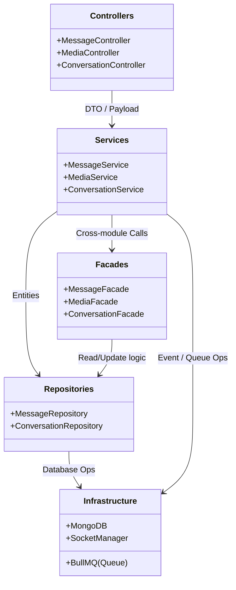
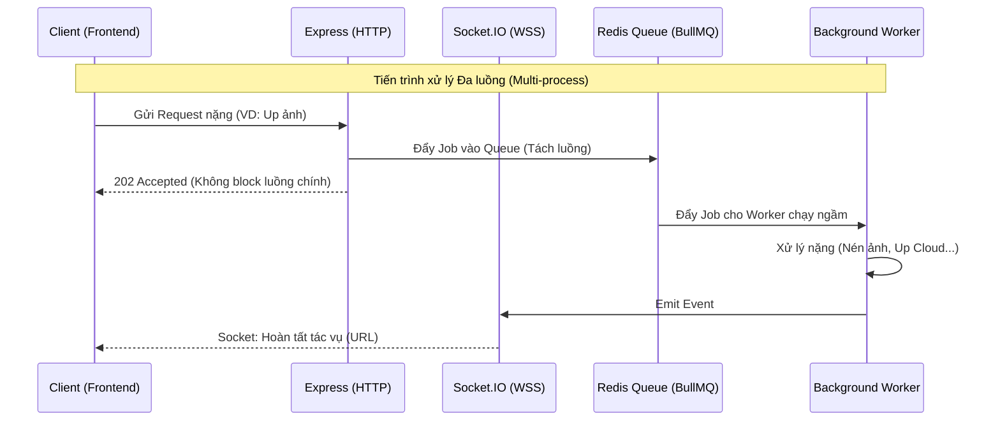
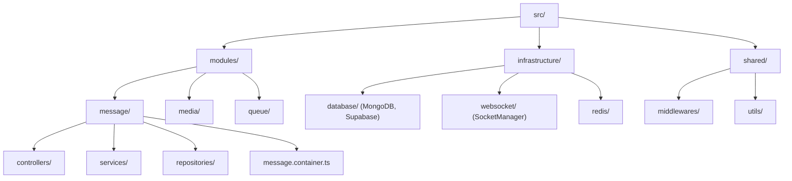
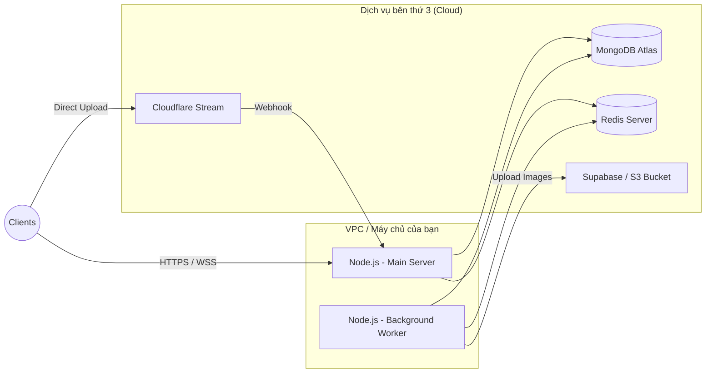
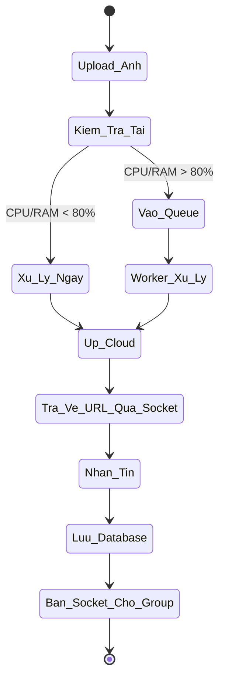

# Kiến trúc 4+1 Views (Chatbot HCMUS Backend)

Mô hình 4+1 là một chuẩn công nghiệp để mô tả kiến trúc phần mềm dưới nhiều góc nhìn khác nhau. Dựa trên mã nguồn hiện tại của dự án, dưới đây là bản vẽ chi tiết các views cho Backend của bạn.

---

## 1. Logical View (Góc nhìn Logic)
Góc nhìn này thể hiện các thành phần phần mềm, cách chúng được chia tách và giao tiếp với nhau (chủ yếu là Clean Architecture & Facade Pattern).

**Nhận xét:** Kiến trúc chia theo Module-based. Các module giao tiếp với nhau không qua Service trực tiếp mà qua **Facade**, giúp giảm sự phụ thuộc chéo (Coupling).

---

## 2. Process View (Góc nhìn Tiến trình)
Góc nhìn này tập trung vào tính đồng thời, bất đồng bộ và luồng dữ liệu (Concurrency, WebSockets, Hàng đợi).

**Nhận xét:** Hệ thống không chỉ có HTTP request-response thông thường mà còn kết hợp WebSockets (thời gian thực) và Background Worker (xử lý ngầm qua Redis) để chịu tải cao.

---

## 3. Development View (Góc nhìn Phát triển)
Góc nhìn này mô tả cách thư mục và mã nguồn được tổ chức để các Lập trình viên dễ dàng phối hợp làm việc.

**Nhận xét:** Áp dụng **Dependency Injection (DI)** thông qua các file `*.container.ts`. Developer khi làm tính năng mới chỉ cần tạo folder module mới mà không làm ảnh hưởng code cũ.

---

## 4. Physical / Deployment View (Góc nhìn Triển khai)
Góc nhìn này mô tả các thiết bị vật lý, Server, Cloud Services mà Backend cần để hoạt động.

**Nhận xét:** Cấu trúc phân tán. Máy chủ Node.js đóng vai trò điều phối, trong khi sức tải lưu trữ được đẩy sang các dịch vụ Cloud chuyên biệt (Atlas, Supabase, Cloudflare).

---

## +1. Scenarios / Use Case View (Góc nhìn Kịch bản)
Góc nhìn này kết nối 4 góc nhìn trên lại với nhau thông qua một Kịch bản (Use Case) cụ thể và quan trọng nhất: **"Gửi ảnh khi hệ thống quá tải"**.

**Nhận xét:** Kịch bản này minh họa rõ rệt cách Backend bảo vệ Database và tối ưu hóa trải nghiệm người dùng thông qua sự kết hợp của Queue, Worker và WebSockets.
