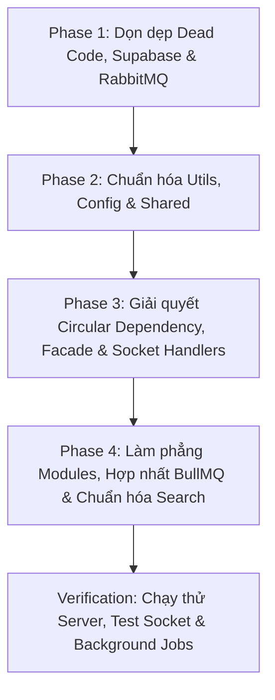

# 🏗️ Đề Xuất Kế Hoạch Tái Cấu Trúc Thư Mục Backend (Backend Refactoring Proposal)

Tài liệu này được biên soạn sau khi rà soát và phân tích toàn diện toàn bộ mã nguồn thư mục `backend/` của dự án **Chatbot-HCMUS**.

Mục tiêu của việc tái cấu trúc:
1. **Tuân thủ triệt để nguyên tắc cốt lõi của dự án**: Modular Monolith, Facade Pattern (giao tiếp liên module), Repository Pattern (giao tiếp DB qua `mongoDBAtlas.ts`).
2. **Loại bỏ các phụ thuộc vòng (Circular Dependencies)** và mã nguồn dư thừa / deprecated (Supabase, các file debug tạm).
3. **Chuẩn hóa cấu trúc và quy ước đặt tên (Naming Conventions)** giữa các module, utils, và types.
4. **Tách biệt rõ ràng các tầng trách nhiệm**: Domain Modules, Infrastructure, Background Workers / Crons, Shared Kernel, Configuration.

---

## 📊 1. Đánh Giá Hiện Trạng Kiến Trúc (Current State Audit)

### 1.1. Những điểm tốt đã đạt được
* **Mô hình Modular Monolith**: Dự án đã chia thành các module nghiệp vụ tương đối rõ ràng (`auth`, `user`, `conversation`, `message`, `media`).
* **Áp dụng IoC/DI nhẹ nhàng**: Mỗi module chính đều đã có `container.ts` để khởi tạo repository, service, controller.
* **Có lớp Facade**: Các module quan trọng (`user`, `conversation`, `message`, `media`) đã tạo file `*.facade.ts` làm cổng giao tiếp ra bên ngoài.
* **Hạ tầng phong phú, hiện đại**: Tích hợp đầy đủ Redis (Cache/Presence/Adapter/Queue), Elasticsearch (Search Engine), Cloudflare R2 (S3-compatible Object Storage) & Stream, BullMQ (Task Queue & Background Processing).

---

### 1.2. Các vấn đề và điểm nghẽn kiến trúc (Architectural Smells & Inconsistencies)

| STT | Vấn đề phát hiện | Vị trí cụ thể | Chi tiết & Tác động |
| :--- | :--- | :--- | :--- |
| 🔴 **1** | **Phụ thuộc vòng (Circular Dependency) giữa Infrastructure và Domain Entities** | `src/infrastructure/database/mongoDBAtlas.ts` | `mongoDBAtlas.ts` import trực tiếp `ConversationModel`, `MessageModel`, `UserModel`, `KeyStoreModel` từ các module để gọi `.createCollection()`. Trong khi đó các module lại import `mongoDB` từ `mongoDBAtlas.ts`. Tầng Hạ tầng không được phép phụ thuộc ngược lên tầng Module Nghiệp vụ. |
| 🔴 **2** | **Vi phạm quy tắc Facade (Bypass Facade / Direct Container Call)** | `socket-manager.ts`<br>`sync-presence.cron.ts`<br>`create_message.job.ts`<br>`process_video.job.ts` | - `socket-manager.ts` và `sync-presence.cron.ts` gọi trực tiếp `userContainer.userService.updatePresence` thay vì gọi qua `userFacade`.<br>- `create_message.job.ts` import trực tiếp `messageContainer.messageRepo.create`.<br>- `process_video.job.ts` gọi `mediaContainer.storageService.downloadFile` dù `mediaFacade` đã có hàm này. |
| 🟡 **3** | **Trùng lặp và phân mảnh thư mục `utils`** | `src/utils/`<br>`src/shared/utils/` | Tồn tại đồng thời 2 thư mục `src/utils` và `src/shared/utils`.<br>- `src/utils/avatar.util.ts` & `src/utils/sync.util.ts`.<br>- Quy ước đặt tên không đồng bộ: cái dùng `.util.ts`, cái dùng `.utils.ts`, cái dùng `.ts` trần (`image.ts`, `cookie.ts`).<br>- File `sync.util.ts` bản chất là sync pipeline sang ES chứ không phải utility thông thường. |
| 🟡 **4** | **Domain Logic bị lẫn vào tầng Configuration** | `src/config/role-user.ts`<br>`src/config/config.ts` | Bảng mapping ngành học (`FACULTY_PROGRAM_MAPPING`) và hàm phân tích MSSV (`getUserRoleFromStudentID`) của trường ĐH KHTN là logic nghiệp vụ của module `User`, nhưng đang bị đặt ở `src/config/` và gán vào `config.getUserRole`. |
| 🟡 **5** | **Module `search` không tuân theo chuẩn của các module khác** | `src/modules/search/` | Module `search` để phẳng 3 file (`search.controller.ts`, `search.route.ts`, `search.service.ts`), các hàm trong service đều dùng `static`, không có `container.ts`, không có `facade.ts`, không có thư mục `dto/`. |
| 🟡 **6** | **Bản chất của `queue` là subsystem nền, không phải domain module thông thường** | `src/modules/queue/` | `queue` đang chứa cả Workers, Crons, và Jobs của các domain khác (`create_message.job`, `upload_image.job`, `process_video.job`). Cần làm rõ vị trí tổ chức của Background Processing trong hệ thống. |
| 🟢 **7** | **Mã nguồn dư thừa / Deprecated (Dead Code)** | `supabaseClient.ts`<br>`src/http/`<br>`check-socket.ts`<br>`src/public/` | - `supabaseClient.ts`: Toàn bộ dự án đã chuyển sang MongoDB Atlas, nhưng `supabaseClient` vẫn được khởi tạo và kết nối ở `index.ts`, tốn tài nguyên và gây hiểu lầm.<br>- `src/http/`: Chứa các file `.http` để test API bằng REST Client, không nên để trong `src/` (bị build vào `dist/`).<br>- `backend/check-socket.ts`: File script debug tạm còn sót ở thư mục gốc.<br>- `src/public/default_avatar.jpg`: Không còn được import hay sử dụng ở bất kỳ đâu.<br>- `src/shared/event/.gitkeep`: Thư mục rỗng chưa sử dụng. |
| 🟢 **8** | **Cấu hình môi trường thiếu schema validation** | `src/config/config.ts` | `config.ts` đọc trực tiếp `process.env` với fallback mặc định mà không validate (ví dụ dùng Zod), dễ dẫn đến lỗi lúc runtime nếu thiếu biến môi trường quan trọng. |
| 🟡 **9** | **`SocketManager` quá tải trách nhiệm (SRP Violation) do ôm đồm logic sự kiện** | `src/infrastructure/websocket/socket-manager.ts` | `SocketManager` vừa quản lý kết nối hạ tầng / Redis Adapter, vừa gánh toàn bộ logic nghiệp vụ realtime (`typing`, `mark_read`, `mark_delivered`, `disconnect` presence) và phải dùng dynamic import để tránh vòng lặp. |
| 🟡 **10** | **Dư thừa Message Broker RabbitMQ khi đã có Redis/BullMQ** | `src/infrastructure/rabbitmq/` | Hệ thống đang chạy song song cả Redis lẫn RabbitMQ. Tuy nhiên RabbitMQ chỉ dùng cho 2 tác vụ (sync ES và sync watermark DB) - hoàn toàn có thể chuyển sang BullMQ (vốn dùng chung Redis), loại bỏ gánh nặng vận hành và tài nguyên của service RabbitMQ. |

---

## 🏛️ 2. So Sánh Cấu Trúc: Trước & Sau Khi Refactor

### 2.1. Cấu trúc hiện tại (Before)

```text
backend/
├── check-socket.ts                   <-- File script debug tạm ở root
├── note.md
├── package.json
├── tsconfig.json
├── src/
│   ├── app.ts                        <-- Chứa import thừa không dùng
│   ├── index.ts
│   ├── routes.ts
│   ├── config/
│   │   ├── config.ts
│   │   └── role-user.ts              <-- Domain logic HCMUS nằm lẫn trong config
│   ├── http/                         <-- File test HTTP nằm trong src/
│   │   ├── conversation.http
│   │   ├── message.http
│   │   └── user.http
│   ├── public/                       <-- Ảnh avatar không ai dùng
│   │   └── default_avatar.jpg
│   ├── utils/                        <-- THƯ MỤC TRÙNG LẶP 1
│   │   ├── avatar.util.ts
│   │   └── sync.util.ts
│   ├── shared/
│   │   ├── event/                    <-- Thư mục rỗng (.gitkeep)
│   │   ├── middlewares/
│   │   ├── types/
│   │   └── utils/                    <-- THƯ MỤC TRÙNG LẶP 2 (Đặt tên lộn xộn)
│   ├── infrastructure/
│   │   ├── database/
│   │   │   ├── database.interface.ts
│   │   │   ├── mongoDBAtlas.ts       <-- Phụ thuộc vòng: import Model từ modules
│   │   │   └── supabaseClient.ts     <-- Dead code (không còn dùng)
│   │   ├── elasticsearch/
│   │   ├── rabbitmq/
│   │   ├── redis/
│   │   ├── storage/
│   │   └── websocket/
│   │       └── socket-manager.ts     <-- Gọi lậu trực tiếp userContainer
│   └── modules/
│       ├── auth/                     <-- Đủ container, nhưng thiếu auth.facade
│       ├── conversation/             <-- Chuẩn
│       ├── media/                    <-- Chuẩn
│       ├── message/                  <-- Chuẩn
│       ├── user/                     <-- user.facade gọi lậu repo thay vì service
│       ├── search/                   <-- BẤT ĐỒNG BỘ: file phẳng, hàm static
│       └── queue/                    <-- Gom lẫn Crons và Jobs của nhiều domain
```

---

### 2.2. Đề xuất cấu trúc mới tối ưu (After - Target Structure)

> **Nguyên tắc**: Giữ vững Modular Monolith, chuẩn hóa các module theo một khuôn mẫu (template) duy nhất, phân tầng rõ ràng từ Ngoài vào Trong: `config` -> `infrastructure` -> `shared` -> `modules` -> `workers`.

```text
backend/
├── tests/                            <-- (Tùy chọn) E2E / Integration tests
├── requests/                         <-- Chuyển từ src/http ra ngoài src/
│   ├── conversation.http
│   ├── message.http
│   └── user.http
├── src/
│   ├── index.ts                      <-- Bootstrap server & connections
│   ├── app.ts                        <-- Express configuration, middlewares, socket init
│   ├── routes.ts                     <-- Khai báo router tổng hợp từ các module
│   │
│   ├── config/                       <-- Cấu hình hệ thống thuần túy
│   │   ├── env.schema.ts             <-- Zod schema kiểm tra biến môi trường
│   │   └── config.ts                 <-- Export config đã được validate an toàn
│   │
│   ├── shared/                       <-- Shared Kernel (Dùng chung cho toàn dự án)
│   │   ├── constants/                <-- Các hằng số dùng chung
│   │   ├── errors/                   <-- AppError, Custom HTTP Error classes
│   │   ├── middlewares/              <-- Express & Socket middlewares chung
│   │   │   ├── auth.middleware.ts
│   │   │   ├── error.middleware.ts
│   │   │   ├── upload.middleware.ts
│   │   │   ├── validate.middleware.ts
│   │   │   └── async-handler.ts      <-- Chuẩn hóa kebab-case
│   │   ├── types/                    <-- Global types, express d.ts
│   │   │   ├── express.d.ts
│   │   │   └── index.ts
│   │   └── utils/                    <-- Toàn bộ utils gom về đây, chuẩn hóa tên
│   │       ├── api-response.util.ts
│   │       ├── avatar.util.ts        <-- Chuyển từ src/utils sang
│   │       ├── cookie.util.ts
│   │       ├── crypto.util.ts
│   │       ├── image.util.ts
│   │       ├── jwt.util.ts
│   │       ├── mongo.util.ts
│   │       ├── populate.util.ts
│   │       ├── system-monitor.util.ts
│   │       ├── time.util.ts
│   │       └── url.util.ts
│   │
│   ├── infrastructure/               <-- Kết nối và quản lý hạ tầng công nghệ
│   │   ├── database/
│   │   │   ├── database.interface.ts
│   │   │   ├── mongodb.connection.ts <-- Thuần túy kết nối & generic CRUD (Đã gỡ circular)
│   │   │   └── init-models.ts        <-- Bootstrap hook đảm bảo collections & indexes cho MongoDB
│   │   ├── redis/
│   │   │   └── redis.client.ts
│   │   ├── elasticsearch/
│   │   │   ├── es.client.ts
│   │   │   └── es.indices.ts
│   │   ├── storage/
│   │   │   ├── storage.interface.ts
│   │   │   └── r2-storage.service.ts
│   │   └── websocket/
│   │       ├── socket.manager.ts         <-- Thuần túy quản lý kết nối, adapter, rooms & emit helpers (~80 dòng)
│   │       ├── socket.events.ts          <-- Hằng số tên sự kiện (SocketEvent enum / constants)
│   │       ├── socket.types.ts           <-- Type definitions cho socket data & payloads
│   │       ├── socket-auth.middleware.ts
│   │       └── handlers/                 <-- TÁCH TOÀN BỘ LOGIC SỰ KIỆN RA ĐÂY (Giải phóng SocketManager)
│   │           ├── index.ts              <-- Điều phối đăng ký: registerSocketHandlers(io, socket)
│   │           ├── presence.handler.ts   <-- Xử lý online, disconnect debounce, cập nhật DB/Redis
│   │           ├── typing.handler.ts     <-- Xử lý typing & stop_typing
│   │           └── watermark.handler.ts  <-- Xử lý mark_delivered & mark_read (sync DB qua BullMQ)
│   │
│   ├── modules/                      <-- CÁC MODULE NGHIỆP VỤ (Cấu trúc Flat Module tinh gọn, không lồng folder 1 file)
│   │   │
│   │   ├── auth/
│   │   │   ├── auth.controller.ts
│   │   │   ├── auth.service.ts
│   │   │   ├── keystore.service.ts
│   │   │   ├── keystore.repository.ts
│   │   │   ├── keystore.entity.ts
│   │   │   ├── auth.dto.ts
│   │   │   ├── auth.route.ts
│   │   │   ├── auth.facade.ts        <-- Bổ sung để đúng chuẩn kiến trúc
│   │   │   ├── auth.container.ts
│   │   │   ├── auth.utils.ts         <-- Tiện ích sinh viên / email
│   │   │   └── strategies/           <-- Chiến lược xác thực OAuth
│   │   │       ├── auth.strategy.ts
│   │   │       ├── google.strategy.ts
│   │   │       └── microsoft.strategy.ts
│   │   │
│   │   ├── user/
│   │   │   ├── user.controller.ts
│   │   │   ├── user.service.ts
│   │   │   ├── user.repository.ts
│   │   │   ├── user.entity.ts
│   │   │   ├── user.dto.ts
│   │   │   ├── user.route.ts
│   │   │   ├── user.facade.ts        <-- Bổ sung updatePresence, chuyển tiếp qua UserService
│   │   │   ├── user.container.ts
│   │   │   └── user.hcmus.ts         <-- Chuyển từ config về (Mapping ngành & giải mã MSSV HCMUS)
│   │   │
│   │   ├── conversation/
│   │   │   ├── conversation.controller.ts
│   │   │   ├── conversation.service.ts
│   │   │   ├── conversation.repository.ts
│   │   │   ├── conversation.entity.ts
│   │   │   ├── conversation.dto.ts
│   │   │   ├── conversation.route.ts
│   │   │   ├── conversation.facade.ts
│   │   │   └── conversation.container.ts
│   │   │
│   │   ├── message/
│   │   │   ├── message.controller.ts
│   │   │   ├── message.service.ts
│   │   │   ├── message.repository.ts
│   │   │   ├── message.entity.ts
│   │   │   ├── message.dto.ts
│   │   │   ├── message.route.ts
│   │   │   ├── message.facade.ts
│   │   │   └── message.container.ts
│   │   │
│   │   ├── media/
│   │   │   ├── media.controller.ts
│   │   │   ├── media.service.ts
│   │   │   ├── media.dto.ts
│   │   │   ├── media.route.ts
│   │   │   ├── media.facade.ts
│   │   │   └── media.container.ts
│   │   │
│   │   └── search/                   <-- ĐỒNG BỘ CÙNG MẪU FLAT VỚI CÁC MODULE TRÊN
│   │       ├── search.controller.ts
│   │       ├── search.service.ts     <-- Service dùng instance methods thay vì static bừa bãi
│   │       ├── search.dto.ts         <-- Tách SearchResult, Query params
│   │       ├── search.route.ts
│   │       ├── search.facade.ts
│   │       └── search.container.ts
│   │
│   └── background/                   <-- TỔNG HỢP TOÀN BỘ TÁC VỤ NỀN VÀO BULLMQ (LOẠI BỎ RABBITMQ)
│       ├── queue.service.ts          <-- Quản lý kết nối và đẩy job vào BullMQ (Fast, Media, Cron)
│       ├── queue.types.ts            <-- Types & enum queue names, job payloads
│       ├── workers/                  <-- Xử lý asynchronous workers
│       │   ├── index.ts
│       │   ├── fast.worker.ts        <-- Xử lý: sync_es, sync_watermark, create_message
│       │   ├── media.worker.ts       <-- Xử lý tác vụ nặng: upload_image, process_video
│       │   └── cron.worker.ts        <-- Xử lý scheduled crons
│       ├── jobs/                     <-- Job handlers cụ thể
│       │   ├── sync-es.job.ts        <-- [CHUYỂN TỪ RABBITMQ]: Đồng bộ User/Conv/Msg sang Elasticsearch
│       │   ├── sync-watermark.job.ts <-- [CHUYỂN TỪ RABBITMQ]: Cập nhật watermark đọc/nhận tin nhắn vào DB
│       │   ├── create-message.job.ts
│       │   ├── upload-image.job.ts
│       │   └── process-video.job.ts
│       └── crons/                    <-- Schedulers định kỳ
│           ├── index.ts
│           ├── sync-presence.cron.ts
│           └── cleanup-media.cron.ts
```

---

## 🔍 3. Chi Tiết Các Giải Pháp Kỹ Thuật Trọng Điểm

### 3.1. Triệt tiêu Circular Dependency ở `mongoDBAtlas.ts` bằng `init-models.ts`
* **Vấn đề**: `mongoDBAtlas.ts` gọi `.createCollection()` cho 4 Model (`UserModel`, `ConversationModel`, `MessageModel`, `KeyStoreModel`) khiến tầng Infrastructure phụ thuộc ngược vào Domain Entities. Trong khi đó các Repository lại import `mongoDB` từ `mongoDBAtlas.ts`, tạo thành phụ thuộc vòng tròn.
* **Giải pháp**:
  - `mongodb.connection.ts`: Thuần túy quản lý kết nối (`connect`, `disconnect`) và generic CRUD (`query`, `findOne`, `insert`, `update`, `delete`), **hoàn toàn không import bất kỳ Model nào**.
  - Tạo file độc lập: `src/infrastructure/database/init-models.ts` đóng vai trò **Bootstrap Hook**:
    ```typescript
    // src/infrastructure/database/init-models.ts
    import { UserModel } from "#@/modules/user/user.entity.js";
    import { ConversationModel } from "#@/modules/conversation/conversation.entity.js";
    import { MessageModel } from "#@/modules/message/message.entity.js";
    import { KeyStoreModel } from "#@/modules/auth/keystore.entity.js";

    export const initializeDatabaseModels = async (): Promise<void> => {
        try {
            await Promise.all([
                UserModel.createCollection(),
                ConversationModel.createCollection(),
                MessageModel.createCollection(),
                KeyStoreModel.createCollection(),
            ]);
            console.log("✅ MongoDB collections & indexes ensured successfully");
        } catch (err: any) {
            if (err.code !== 48) { // Bỏ qua lỗi collection đã tồn tại (NamespaceExists)
                console.error("❌ Error ensuring MongoDB collections:", err);
                throw err;
            }
        }
    };
    ```
  - **Cách gọi tại `src/index.ts`**: Chỉ được gọi 1 lần duy nhất lúc khởi động server sau khi `mongoDB.connect()` thành công:
    ```typescript
    await mongoDB.connect();
    await initializeDatabaseModels();
    ```
* **Lợi ích**: `mongodb.connection.ts` sạch 100%, các Repository import `mongoDB` hoàn toàn một chiều, và `init-models.ts` chỉ được gọi lúc server khởi động mà không bị bất kỳ module nào import ngược lại.

### 3.2. Chấn chỉnh việc tuân thủ Facade Pattern
Tuân thủ nghiêm ngặt điều lệ trong `.agent/skills/controlled-ai-coding/SKILL.md`:
1. **Mọi module khác gọi sang User**: Phải qua `userFacade`. Bổ sung hàm `updatePresence(userId, lastActive)` vào `userFacade` để `socket-manager.ts` và `sync-presence.cron.ts` không được gọi trực tiếp `userContainer.userService`.
2. **`userFacade` không gọi trực tiếp Repository**: `UserFacade` nên delegate qua `UserService` (hoặc Repository chỉ khi là tác vụ query thuần túy, nhưng để bảo đảm nghiệp vụ nhất quán thì đi qua `UserService` là an toàn nhất).
3. **Background Jobs & Consumers**:
   - `create-message.job.ts`: Gọi `messageFacade.createMessageFromQueue(...)` thay vì import `messageContainer.messageRepo.create`.
   - `process-video.job.ts`: Gọi `mediaFacade.downloadFile(...)` thay vì gọi `mediaContainer.storageService.downloadFile`.

### 3.3. Tách Domain Logic HCMUS ra khỏi `src/config/`
* Chuyển `role-user.ts` thành `src/modules/user/constants/hcmus-programs.ts` và logic phân giải MSSV thành helper của module `user`: `src/modules/user/utils/student-id.util.ts`.
* Gỡ bỏ `config.getUserRole` khỏi class `Config`.

### 3.4. Dọn dẹp dứt điểm Supabase và Dead Code
* Xóa bỏ `src/infrastructure/database/supabaseClient.ts`.
* Xóa bỏ cấu hình `supabase: { uri, publishableKey }` trong `config.ts` và `.env`.
* Xóa dòng `supabaseDB.connect()` trong `index.ts`.
* Gỡ bỏ package `@supabase/supabase-js` khỏi `package.json` khi hoàn tất để làm nhẹ bundle và node_modules.
* Xóa file rác `check-socket.ts` ở root và `src/public/default_avatar.jpg`.
* Chuyển thư mục `src/http/` ra ngoài thư mục `requests/` tại root.

### 3.5. Chuẩn hóa module `search`
* Đổi `SearchService` từ các static methods thành class thông thường, inject `esClient`.
* Tạo `search.container.ts` theo cùng pattern với các module khác.
* Tách các types (`SearchResult`) ra file `dto/search.dto.ts`.

### 3.6. Định vị lại `queue` thành `src/background/`
* `queue` hiện tại chứa các tác vụ chạy ngầm của toàn hệ sinh thái (Media rendering, Message async save, Presence sync, Cron jobs).
* Xếp nó thành tầng `src/background/` (hoặc `src/jobs/`) sẽ phản ánh đúng tính chất kỹ thuật hơn là để lẫn trong `src/modules/` (nơi chỉ nên chứa các domain nghiệp vụ có API/Entities riêng).

### 3.7. Tách biệt Socket Infrastructure và Socket Event Handlers (Giải phóng gánh nặng cho SocketManager)
* **Vấn đề**: `SocketManager` hiện tại đang đảm nhận 2 nhiệm vụ trái ngược:
  1. *Hạ tầng Socket & Redis Adapter* (khởi tạo Server, quản lý socket rooms, generic emit methods).
  2. *Nghiệp vụ Realtime Events* (`typing`, `mark_read`, `mark_delivered`, `disconnect` presence).
  Điều này khiến file phình to gần 300 dòng, phải dùng dynamic import (`await import('#@/modules/conversation/...')`, `await import('#@/infrastructure/rabbitmq/...')`) để tránh vòng lặp phụ thuộc.
* **Giải pháp**:
  - `socket.manager.ts`: Chỉ làm đúng nhiệm vụ hạ tầng kết nối, cấu hình Redis Adapter, quản lý rooms và cung cấp các hàm helper phát tín hiệu (`emitToUser`, `emitToGroup`, `joinGroup`, `leaveGroup`, `isUserOnline`). Giảm từ ~300 dòng xuống chỉ còn ~80 dòng.
  - Tách toàn bộ logic lắng nghe và xử lý sự kiện vào thư mục `src/infrastructure/websocket/handlers/`:
    - `handlers/index.ts`: Hàm điều phối chính `registerSocketHandlers(io, socket, socketManager)` để đăng ký toàn bộ sự kiện khi socket kết nối.
    - `handlers/presence.handler.ts`: Đón nhận sự kiện kết nối, thiết lập Redis presence, xử lý sự kiện `disconnect` (debounce 3s, cập nhật Redis, gọi `userFacade.updatePresence(...)` và broadcast `user_offline`).
    - `handlers/typing.handler.ts`: Đón nhận `typing` và `stop_typing` và phân phối đến các receiver.
    - `handlers/watermark.handler.ts`: Đón nhận `mark_delivered` và `mark_read`. Tuân thủ chiến lược **Write-Behind Caching**: (1) Ghi tức thì vào Redis cache -> (2) Đẩy job `sync_watermark` vào BullMQ -> (3) Broadcast sự kiện watermark qua `conversationFacade`.
  - Khai báo hằng số tên sự kiện trong `socket.events.ts` (ví dụ `SocketEvents.TYPING`, `SocketEvents.NEW_MESSAGE`...) để không hardcode string rải rác.
* **Lợi ích**:
  - Tuân thủ nguyên lý Đơn trách nhiệm (Single Responsibility Principle).
  - Khắc phục triệt để việc dùng dynamic import và vi phạm facade trong websocket.
  - Dễ dàng mở rộng thêm các sự kiện realtime trong tương lai (WebRTC call, reactions realtime, poll voting...) bằng cách chỉ cần thêm 1 file handler mới mà không động vào `socket.manager.ts`.

### 3.8. Áp dụng Cấu Trúc Module Phẳng (Flat Module Structure - Tránh lồng folder 1 file)
* **Quyết định thiết kế**: Thay vì tạo quá nhiều folder con (`controllers/`, `services/`, `repositories/`, `entities/`, `dto/`, `routes/`) chỉ để chứa đúng **1 file duy nhất** trong mỗi folder, toàn bộ các thành phần của module sẽ được đặt trực tiếp tại thư mục gốc của module đó:
  - `[module].controller.ts`
  - `[module].service.ts`
  - `[module].repository.ts` (nếu có lưu trữ DB)
  - `[module].entity.ts` (nếu có schema/model DB)
  - `[module].dto.ts`
  - `[module].route.ts`
  - `[module].facade.ts`
  - `[module].container.ts`
* **Lợi ích**:
  - **Tránh "Folder Fatigue"**: Không phải click mở 3-4 tầng thư mục chỉ để sửa 1 dòng code controller hay route.
  - **Import nội bộ cực kỳ tinh gọn**: Các file cùng cấp import trực tiếp nhau (ví dụ `./user.service.js`, `./user.repository.js`) thay vì phải nhảy thư mục cha `../services/user.service.js`.
  - **Trực quan & Dễ nắm bắt**: Khi mở một module, lập trình viên thấy ngay toàn cảnh cấu trúc đầy đủ của tính năng đó trong 1 màn hình.
  - **Ngoại lệ hợp lý**: Chỉ tạo folder con khi thực sự có nhiều hơn 1 file cùng loại chức năng (ví dụ `auth/strategies/` chứa nhiều chiến lược `google.strategy.ts`, `microsoft.strategy.ts`...).

### 3.9. Hợp Nhất Toàn Bộ Hàng Đợi Vào BullMQ (Loại Bỏ Hoàn Toàn RabbitMQ)
* **Lý do loại bỏ RabbitMQ**:
  1. *Giảm thiểu tài nguyên & độ phức tạp hạ tầng*: Dự án bắt buộc phải có **Redis** (phục vụ Socket.io Redis Adapter, Caching, User Presence, BullMQ). Việc chạy thêm một message broker riêng biệt là **RabbitMQ** (viết bằng Erlang, ngốn nhiều RAM) chỉ để xử lý 2 tác vụ (`sync_es` và `sync_watermark_db`) là quá dư thừa, tạo thêm điểm lỗi (single point of failure) và tăng độ phức tạp khi deploy/docker-compose.
  2. *Hợp nhất về một nền tảng Queue duy nhất*: **BullMQ** (chạy trên nền Redis) đã có sẵn trong dự án với đầy đủ tính năng cao cấp: Retry có Exponential Backoff, Concurrency slots, Dead-letter handling, Rate-limiting, Scheduled Cron. Việc hợp nhất giúp toàn bộ background tasks được quản lý tập trung tại một nơi duy nhất.
* **Cách thức chuyển đổi**:
  - **Đồng bộ Elasticsearch**: Thay vì gọi `publishToQueue('sync_user_es', ...)`, ta chuyển thành `queueService.addJob('sync_es', { index: 'users', operation, data })` đẩy vào `fastQueue`. Tạo job handler `src/background/jobs/sync-es.job.ts` để gọi `esClient.index()` hoặc `esClient.delete()`.
* **Đảm bảo nguyên vẹn 100% chiến lược Write-Behind (Write-Back) Caching**:
  - **Quy trình hoạt động (giống hệt luồng RabbitMQ trước đây)**:
    1. **Bước 1 (Realtime & Cache First)**: Khi client gửi sự kiện `mark_delivered` hoặc `mark_read`, socket handler sẽ **ghi tức thì vào Redis** (`watermarks:${conversationId}`). Phản hồi lập tức và broadcast socket tới các thành viên khác với độ trễ cực thấp (< 1ms).
    2. **Bước 2 (Queue Job)**: Handler đẩy 1 background job `sync_watermark` vào hàng đợi nhanh của BullMQ (`fastQueue`) với payload `{ conversationId, userId, messageId, type }`.
    3. **Bước 3 (Async Persistence to DB)**: BullMQ Worker (`sync-watermark.job.ts`) xử lý chạy ngầm, gọi `conversationFacade.updateWatermark(...)` để lưu trữ bền vững vào MongoDB Atlas mà không hề làm nghẽn (non-blocking) luồng WebSocket realtime.
  - **Dọn dẹp mã nguồn & dependencies**:
    - Xóa bỏ thư mục `src/infrastructure/rabbitmq/`.
    - Xóa bỏ kết nối `rabbitmq.connect()` trong `src/index.ts`.
    - Xóa `config.rabbitmq.uri` trong `src/config/config.ts` và biến môi trường `RABBITMQ_URI` trong `.env`.
    - Gỡ bỏ package `amqplib` và `@types/amqplib` khỏi `package.json`.
    - Xóa service `rabbitmq` khỏi `docker-compose.yml`.

---

## 📋 4. Bảng So Sánh Các Lựa Chọn Refactor (Options & Trade-offs)

Bạn có thể cân nhắc giữa 2 phương án thực thi:

| Tiêu chí | Phương án A: Tinh gọn & An toàn tối đa (Conservative) | Phương án B: Chuẩn hóa toàn diện Clean Architecture (Recommended) |
| :--- | :--- | :--- |
| **Phạm vi thay đổi** | - Gộp `src/utils` vào `src/shared/utils`.<br>- Dọn dẹp Supabase, `check-socket.ts`, `src/http`.<br>- Sửa các điểm vi phạm Facade (`userFacade.updatePresence`).<br>- Gỡ circular dependency ở `mongoDBAtlas.ts`. | - Thực hiện toàn bộ Phương án A.<br>- Làm phẳng cấu trúc các module (`*.controller.ts`, `*.service.ts`...).<br>- Chuẩn hóa module `search` (Container, DTO, instance service).<br>- **Loại bỏ hoàn toàn RabbitMQ**, chuyển toàn bộ ES sync & Watermark sync sang BullMQ.<br>- Tách `modules/queue` thành tầng `src/background/` độc lập.<br>- Chuyển logic MSSV HCMUS từ `config` sang module `user`.<br>- Thêm schema validation cho biến môi trường (`Zod`). |
| **Thời gian thực hiện** | Nhanh (~1 - 2 giờ làm việc). | Vừa phải (~3 - 4 giờ làm việc). |
| **Rủi ro hồi quy (Regression)** | Rất thấp, đường dẫn import của các module chính giữ nguyên. | Thấp, cần cập nhật đường dẫn import `#@/modules/queue` và `#@/modules/search`. |
| **Khả năng mở rộng (Scalability)** | Trung bình, vẫn còn một số chỗ bất đối xứng giữa các module. | Rất cao, codebase đạt chuẩn production, dễ onboarding lập trình viên mới. |

---

## 🚀 5. Lộ Trình Thực Hiện Từng Bước (Implementation Roadmap)

Để đảm bảo **không làm gián đoạn hệ thống** đang chạy (Zero-downtime development), lộ trình refactor được chia thành 4 Phase:



### Phase 1: Dọn dẹp Dead Code & Chuyển tài nguyên không thuộc `src/`
1. Di chuyển `src/http/` ra thư mục `requests/` ở root.
2. Xóa bỏ `backend/check-socket.ts` và `src/public/default_avatar.jpg`.
3. Gỡ bỏ `supabaseClient.ts`, loại bỏ kết nối Supabase trong `src/index.ts` và `config.ts`.
4. Dọn dẹp các import không sử dụng trong `app.ts` (ví dụ `conversationContainer`, `userContainer`).
5. **Gỡ bỏ RabbitMQ**: Xóa bỏ kết nối `rabbitmq.connect()` trong `index.ts`, xóa cấu hình trong `config.ts`, gỡ bỏ `amqplib` khỏi `package.json` và service trong `docker-compose.yml`.

### Phase 2: Chuẩn hóa `shared/utils` và `config`
1. Di chuyển `src/utils/avatar.util.ts` sang `src/shared/utils/avatar.util.ts`.
2. Đổi tên toàn bộ các file trong `src/shared/utils/` theo chuẩn thống nhất: `[name].util.ts`.
3. Di chuyển logic `FACULTY_PROGRAM_MAPPING` và `getUserRoleFromStudentID` từ `config/role-user.ts` sang `modules/user/user.hcmus.ts`.
4. Xóa bỏ thư mục `src/utils/`.

### Phase 3: Triệt tiêu Circular Dependency, Chấn chỉnh Facade & Tách Socket Handlers
1. **Tách hàm gọi `createCollection()` ra khỏi `mongodb.connection.ts` sang `src/infrastructure/database/init-models.ts`**: Xóa triệt để các import Model trong class kết nối DB. Tại `index.ts`, gọi `initializeDatabaseModels()` sau khi `mongoDB.connect()` thành công.
2. Bổ sung method `updatePresence(userId: string, lastActive: Date)` vào `UserFacade`.
3. **Tách các Event Handlers khỏi `socket-manager.ts`**: Đưa vào thư mục `src/infrastructure/websocket/handlers/` (`presence.handler.ts`, `typing.handler.ts`, `watermark.handler.ts`). Gọi `userFacade.updatePresence(...)` thay vì trực tiếp `userContainer`.
4. Sửa `create_message.job.ts` và `process_video.job.ts` để tương tác qua Facade thay vì chọc trực tiếp Container/Repo.
5. Sửa lỗi đặt tên "Test" trong `auth.container.ts` và route đăng nhập Microsoft trong `auth.route.ts`.

### Phase 4: Làm phẳng cấu trúc Modules, Chuẩn hóa `search` và Hợp nhất `background` (BullMQ)
1. **Làm phẳng các module (Flat Structure)**: Chuyển các file từ các thư mục con lồng 1 file (`controllers/`, `services/`, `repositories/`, `entities/`, `dto/`, `routes/`) ra trực tiếp thư mục gốc của từng module (`user.controller.ts`, `conversation.service.ts`...).
2. **Chuẩn hóa `modules/search/`**: Đồng bộ theo cùng mẫu flat module (`search.controller.ts`, `search.service.ts` dạng class instance, `search.dto.ts`, `search.route.ts`, `search.facade.ts`, `search.container.ts`).
3. **Tái cấu trúc và hợp nhất toàn bộ Background Jobs vào BullMQ (`src/background/`)**:
   - Xóa bỏ hoàn toàn thư mục `src/infrastructure/rabbitmq/`.
   - Tạo `sync-es.job.ts` (thay thế cho 3 queues rabbitmq: `sync_user_es`, `sync_conversation_es`, `sync_message_es`).
   - Tạo `sync-watermark.job.ts` (thay thế cho `sync_watermark_db` của rabbitmq).
   - Di chuyển các jobs hiện có: `create-message.job.ts`, `upload-image.job.ts`, `process-video.job.ts`.
   - Di chuyển các crons: `sync-presence.cron.ts`, `cleanup-media.cron.ts`.

---

## 🎯 6. Kế Hoạch Xác Minh Sau Refactor (Verification Plan)

1. **Kiểm tra biên dịch TypeScript**:
   ```bash
   npm run build
   ```
   *Mục tiêu*: Không có bất kỳ lỗi import, type mismatch hay broken path nào.
2. **Khởi động hệ thống**:
   ```bash
   npm run dev
   ```
   *Mục tiêu*: Các kết nối MongoDB, Redis, Elasticsearch và BullMQ Workers khởi động bình thường (không còn lỗi hay cảnh báo liên quan đến RabbitMQ và Supabase); không có lỗi circular dependency warning.
3. **Kiểm tra tính năng cốt lõi**:
   - Đăng nhập (Google / Microsoft).
   - Chat thời gian thực qua Socket.IO (gửi tin nhắn, typing indicator, mark read/delivered).
   - Tải lên ảnh / video và xử lý hậu kỳ qua BullMQ Worker.
   - Tìm kiếm người dùng, phòng chat, tin nhắn qua module `search`.
   - Đối soát tự động presence (online/offline) qua BullMQ Cron Job.
