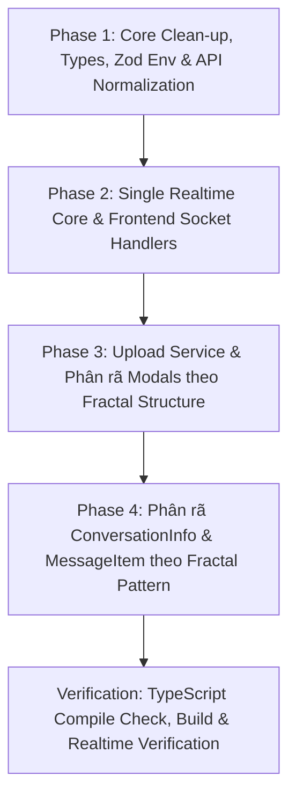

# 🏗️ Đề Xuất Kế Hoạch Tái Cấu Trúc Frontend (Frontend Refactoring Proposal)

Tài liệu này được biên soạn sau khi rà soát, phân tích toàn diện mã nguồn thư mục `frontend/` của dự án **Chatbot-HCMUS** (Next.js 16 App Router, React 19, Tailwind CSS v4, Zustand 5, TanStack Query v5, Socket.IO Client) và đã được thống nhất qua các buổi thảo luận kỹ thuật.

Mục tiêu của việc tái cấu trúc:
1. **Khắc phục lỗi rò rỉ 2 kết nối WebSocket song song**: Thiết lập Single Source of Truth cho Socket realtime, loại bỏ hoàn toàn việc tạo 2 kết nối độc lập giữa `SocketProvider` và `useChatSocket`.
2. **Tách biệt Socket Event Handlers đối xứng Backend**: Phân rã file `useChatSocket.ts` (415 dòng) thành các handlers chuyên biệt (`message`, `conversation`, `watermark`, `presence`, `typing`), có hàm cleanup chống memory leak / duplicate listeners.
3. **Áp dụng triệt để kiến trúc Fractal Component (Co-location .tsx + .ts)**: 
   - Mỗi component (dù là cha hay con) đều là một folder riêng chứa cặp bài trùng: `.tsx` (Giao diện) và `.ts` (Logic hook).
   - Component con chỉ phục vụ riêng cho cha sẽ nằm trong thư mục `components/[SubComponent]/` của chính cha đó.
4. **Xóa bỏ thư mục `Modals/` tập trung cồng kềnh**: Phân bổ các modal cục bộ về đúng component cha sở hữu chúng (Private Modals), chỉ giữ lại các modal đa điểm thực sự (Global Modals) mount tại Layout.
5. **Chuẩn hóa tầng Data Fetching & API Client**: Tự động unwrap `res.data.data` đồng nhất, bổ sung type-safety cho DTOs, xóa bỏ các đoạn code kiểm tra phòng thủ `(res as any).data || res`.
6. **Thống nhất Domain Models & Types**: Triệt tiêu xung đột kiểu dữ liệu (`User`, `UserProfile`, `UserProfileResponse`, `studentID` vs `student_id`).
7. **Tách rời S3 Multipart Video Upload Service**: Đưa thuật toán upload chunk 5MB ra khỏi hook ô chat `useChatInput.ts`.

---

## 📊 1. Đánh Giá Hiện Trạng Kiến Trúc (Current State Audit)

### 1.1. Những điểm tốt đã đạt được
* **Tổ chức theo hướng Feature-Based (Feature-Driven Architecture)**: Mã nguồn đã được chia thành các thư mục tính năng (`features/auth`, `features/chat`, `features/dashboard`, `features/profile`).
* **Stack công nghệ hiện đại, tối ưu**: Next.js 16 App Router, React 19 với React Compiler (`reactCompiler: true`), Tailwind CSS v4 sử dụng CSS variables và Theme tokens gọn gàng, hỗ trợ Dark Mode mượt mà.
* **State Management kết hợp hiệu quả**: Phối hợp chuẩn xác giữa **Zustand** (trạng thái client tức thời: active conversation, modals, search mode, typing users) và **TanStack Query** (quản lý server state, infinite scroll pagination, cache sync).
* **Áp dụng Pattern Dataloader cho Bulk Fetching**: `userStore.ts` đã triển khai cơ chế gom các `userId` cần tải và gọi API `getBulkUsers` sau debounce 50ms, tối ưu số lượng HTTP request khi render danh sách tin nhắn.

---

### 1.2. Bảng tổng hợp các vấn đề và điểm nghẽn kiến trúc (Architectural Smells & Inconsistencies)

| STT | Vấn đề phát hiện | Vị trí cụ thể | Chi tiết & Tác động |
| :--- | :--- | :--- | :--- |
| 🔴 **1** | **Rò rỉ 2 kết nối WebSocket chạy song song (Dual Socket Leak)** | `src/providers/SocketProvider.tsx`<br>`src/features/chat/hooks/useChatSocket.ts` | - `SocketProvider` gọi `io(...)` tạo 1 kết nối cấp phát qua Context.<br>- `useChatSocket` ở layout lại tự gọi `io(...)` tạo **thêm 1 kết nối thứ hai** độc lập để lắng nghe 12 sự kiện chat.<br>- Các component khác (`useChatInput`, `useFriendMessageList`) lại inject socket từ `SocketProvider` để emit!<br>👉 **Hậu quả**: Mỗi người dùng ngốn 2 socket connection lên backend/Redis, dễ gây desync và memory leak. |
| 🔴 **2** | **`useChatSocket.ts` quá tải trách nhiệm (415 dòng code)** | `src/features/chat/hooks/useChatSocket.ts` | File hook lắng nghe 12 sự kiện realtime khác nhau, trong mỗi sự kiện lại chứa 20-40 dòng code mutate trực tiếp TanStack Query cache (`pages.map(...)`). Thiếu hàm cleanup riêng biệt cho từng sự kiện. |
| 🔴 **3** | **Tầng API trả về dữ liệu bất nhất (Inconsistent Response Unwrapping)** | `src/features/auth/api/authApi.ts`<br>`src/features/chat/api/*.api.ts`<br>`src/features/profile/api/profileApi.ts` | Backend trả về chuẩn `ApiResponse<T> = { message, data: T }`. Tuy nhiên:<br>- `authApi`, `profileApi`, `searchApi` trả về `res.data.data`.<br>- `conversationApi`, `messageApi`, `userApi`, `mediaApi` lại trả về `response.data` (`{ message, data }`).<br>👉 Khiến code tầng trên phải viết phòng thủ: `(res as any).data \|\| res`, `(Array.isArray(res.data) ? res.data : res)`. |
| 🟡 **4** | **Phân tán và gom chung 10 Modals vào một thư mục rác `Modals/`** | `src/features/chat/components/Modals/` | 10 modals bị gom chung vào một thư mục, trong khi 70% số modal đó chỉ phục vụ cho đúng 1 component cha (ví dụ `BlockUserModal`, `DisbandGroupModal`, `MediaViewerModal` chỉ dùng cho `ConversationInfo`; `ReactionModal` chỉ dùng cho `MessageItem`). |
| 🟡 **5** | **God Component `ConversationInfo.tsx` phình to 726 dòng** | `src/features/chat/components/ChatArea/ConversationInfo.tsx` | Ôm đồm: kéo thả resize, gọi API trực tiếp, tải media, xem ảnh/video, nhúng 4 modals, xử lý chặn/giải tán nhóm... vi phạm nghiêm trọng Single Responsibility Principle. |
| 🟡 **6** | **Trùng lặp và xung đột kiểu dữ liệu User (Type Identity Conflict)** | `src/features/auth/types.ts`<br>`src/features/chat/types/index.ts`<br>`src/features/profile/api/profileApi.ts`<br>`src/features/auth/stores/authStore.ts` | Tồn tại đồng thời `UserProfile`, `User`, `UserProfileResponse`, lẫn lộn giữa trường `studentID` và `student_id`. `authStore` phải dùng type hack inline: `Pick<UserProfile, ...> & { studentID?: string, student_id?: string, ... }`. |
| 🟡 **7** | **Ôm đồm logic Upload S3 Multipart trong Hook ô nhập chat** | `src/features/chat/hooks/useChatInput.ts` | Hàm `uploadVideoMultipart` dài gần 60 dòng (tính chunk 5MB, cắt slice file, gọi presigned URLs song song, gom ETags) nằm lẫn trong hook nhập text chat. |
| 🟡 **8** | **Lỗi chặn mở Modals khi chưa chọn cuộc trò chuyện** | `src/features/chat/components/ChatScreen/ChatScreen.tsx` | `ChatScreen.tsx` có đoạn code: `if (!activeConversation) return <EmptyChatScreen />;`. Toàn bộ modals (`CreateGroupModal`, `UserProfileModal`) nằm bên dưới lệnh này, khiến người dùng không thể tạo nhóm hay xem profile từ màn hình trống. |
| 🟢 **9** | **Auth Protection & Routing giật trang (Route Flash / FOUC)** | `src/app/providers.tsx`<br>`src/features/auth/hooks/useLogout.ts` | - Chuyển hướng bảo vệ route bằng `useEffect` trong `Providers` gây flash màn hình.<br>- Hook `useLogout.ts` thực chất là `useAuth` (lấy user hiện tại, check auth, logout), khiến `NavBar` và `HomePlaceholder` phải import `useLogout` chỉ để lấy tên user hiển thị! |
| 🟢 **10** | **File rác `note.txt`, lỗi chính tả và sai branding** | `src/stores/note.txt`<br>`src/features/dashboard/components/HomePlaceHover.tsx`<br>`src/features/dashboard/components/NavBar.tsx` | - Các file `note.txt` rỗng còn sót lại ở `stores/`, `hooks/`, `providers/`.<br>- Sai chính tả tên file: `HomePlaceHover.tsx` (Hover thay vì Holder).<br>- Sai branding: Hardcode "SchoolConnect" trong `NavBar.tsx` (dự án là HCMUS Chatbot).<br>- `app/layout.tsx` còn giữ nguyên metadata boilerplate "Create Next App". |

---

## 🏛️ 2. So Sánh Cấu Trúc Thư Mục: Trước & Sau Khi Refactor

### 2.1. Cấu trúc hiện tại (Before)

```text
frontend/src/
├── app/
│   ├── (chat)/layout.tsx             <-- useChatSocket() tự tạo socket thứ 2 ở đây
│   ├── layout.tsx                    <-- Metadata mặc định "Create Next App"
│   └── providers.tsx                 <-- Client redirect giật lag, bọc SocketProvider ở cả Login
├── config/
│   ├── constant.ts                   <-- ALLOWED_DOMAINS (Phân mảnh với utils/constants.ts)
│   └── env.ts                        <-- Thiếu Zod, lệch port fallback 3001
├── features/
│   ├── auth/
│   │   ├── api/authApi.ts            <-- Đặt tên camelCase, unwrap res.data.data
│   │   └── hooks/useLogout.ts        <-- Tên sai bản chất (vừa lấy user vừa check auth)
│   ├── chat/
│   │   ├── api/                      <-- Không unwrap res.data.data, return { message, data }
│   │   ├── components/
│   │   │   ├── ChatArea/
│   │   │   │   ├── ChatArea.tsx
│   │   │   │   ├── ChatHeader.tsx
│   │   │   │   ├── ChatInput.tsx
│   │   │   │   └── ConversationInfo.tsx <-- GOD COMPONENT (726 dòng)
│   │   │   ├── ChatCard.tsx
│   │   │   ├── ChatScreen/
│   │   │   ├── Messages/
│   │   │   │   ├── MessageList.tsx
│   │   │   │   ├── MessageItem.tsx
│   │   │   │   ├── LinkPreview.tsx
│   │   │   │   └── ReactionModal.tsx
│   │   │   ├── Modals/               <-- 10 MODALS BỊ GOM CHUNG MỘT NƠI CỒNG KỀNH
│   │   │   └── Sidebar/
│   │   ├── hooks/                    <-- useChatSocket 415 dòng, useChatInput ôm upload S3
│   │   ├── stores/
│   │   └── types/index.ts            <-- User trùng lặp
│   ├── dashboard/
│   │   └── components/
│   │       ├── HomePlaceHover.tsx    <-- Sai chính tả (Hover thay vì Holder)
│   │       └── NavBar.tsx            <-- Hardcode "SchoolConnect"
│   └── profile/
│       └── api/profileApi.ts         <-- UserProfileResponse trùng lặp
├── hooks/
│   ├── note.txt                      <-- Dead placeholder
│   └── useSocket.ts
├── providers/
│   ├── note.txt                      <-- Dead placeholder
│   └── SocketProvider.tsx            <-- Socket 1 bị cô lập
├── stores/note.txt                   <-- Dead placeholder
├── types/type.ts                     <-- Chỉ vỏn vẹn 3 dòng (ApiResponse<T>)
└── utils/constants.ts                <-- DEFAULT_AVATAR (Phân mảnh với config/constant.ts)
```

---

### 2.2. Đề xuất cấu trúc mới tối ưu (After - Target Fractal Architecture)

> **3 Nguyên tắc cốt lõi**:
> 1. **Fractal Component**: Mỗi component là 1 thư mục riêng gồm `Component.tsx` (giao diện) + `useComponent.ts` (logic). Các component con phụ thuộc cha nằm trong thư mục `components/[SubComponent]/` của chính cha đó.
> 2. **Phân rã Modals**: Private Modals chuyển thành con của component cha; chỉ giữ lại Global Modals (`UserProfileModal`, `CreateGroupModal`, `ForwardModal`) ở cấp module và mount tại Layout.
> 3. **Socket Handlers Đối Xứng Backend**: Tách `useChatSocket.ts` thành thư mục `socket/handlers/` phân theo từng domain sự kiện (`message`, `conversation`, `watermark`, `presence`, `typing`).

```text
frontend/src/
├── app/                              <-- Next.js App Router (Layouts & Routing mỏng)
│   ├── (auth)/page.tsx               <-- Trang đăng nhập (Không bọc Socket)
│   ├── (main)/                       <-- Route Group bảo vệ (Cần xác thực)
│   │   ├── layout.tsx                <-- Auth Guard & Cấp phát SocketProvider duy nhất
│   │   ├── home/page.tsx
│   │   ├── profile/page.tsx
│   │   └── (chat)/
│   │       ├── layout.tsx            <-- Layout Chat (Resizable Sidebar + Global Modals)
│   │       ├── chat/page.tsx
│   │       ├── direct-chat/page.tsx
│   │       └── group-chat/page.tsx
│   ├── layout.tsx                    <-- Root: Fonts, ThemeProvider, Metadata HCMUS chuẩn
│   └── providers.tsx                 <-- Chỉ bọc QueryProvider, ThemeProvider, GoogleOAuth
│
├── config/
│   ├── env.schema.ts                 <-- Zod schema kiểm tra biến môi trường client
│   ├── env.ts                        <-- Export biến môi trường an toàn (Port fallback 5000)
│   └── constants.ts                  <-- Hợp nhất ALLOWED_DOMAINS & DEFAULT_AVATAR
│
├── shared/ (hoặc src/shared/ & src/components/ui)
│   ├── types/                        <-- Hệ thống Types chuẩn hóa toàn dự án
│   │   ├── api.types.ts              <-- ApiResponse<T>, PaginationParams
│   │   ├── user.types.ts             <-- User, UserPresence (Thống nhất student_id)
│   │   ├── conversation.types.ts     <-- Conversation, Watermark, BlockInfo
│   │   ├── message.types.ts          <-- Message, Reaction, MediaPayload
│   │   └── index.ts
│   │
│   ├── components/ui/                <-- UI Primitives tái sử dụng (Atomic Components)
│   │   ├── Modal/                    <-- Base Modal (Backdrop blur, phím Esc, click outside)
│   │   │   ├── Modal.tsx
│   │   │   └── useModal.ts
│   │   ├── Avatar/                   <-- Base Avatar tự fallback chữ cái / DEFAULT_AVATAR
│   │   │   └── Avatar.tsx
│   │   ├── Button/
│   │   │   └── Button.tsx
│   │   ├── TabButton/
│   │   ├── Logo/
│   │   └── index.ts
│   │
│   ├── hooks/                        <-- Custom hooks toàn cục
│   │   ├── useAuth.ts                <-- Thay thế useLogout: Cung cấp user, isAuthenticated, logout
│   │   ├── useDebounce.ts
│   │   └── useMediaQuery.ts
│   │
│   ├── services/                     <-- Services kỹ thuật dùng chung
│   │   ├── api.client.ts             <-- Axios instance, interceptors, refresh token, unwrap helper
│   │   ├── socket.service.ts         <-- Singleton Socket Manager (Lifecycle & emitter)
│   │   └── upload.service.ts         <-- Xử lý S3 Multipart Video & Image Upload
│   │
│   └── utils/
│       ├── cn.util.ts
│       └── time.util.ts
│
└── features/                         <-- CÁC MODULE NGHIỆP VỤ
    │
    ├── auth/
    │   ├── api/auth.api.ts           <-- Chuẩn hóa tên [module].api.ts
    │   ├── components/
    │   │   ├── LoginForm/
    │   │   │   ├── LoginForm.tsx
    │   │   │   └── useLoginForm.ts
    │   │   ├── AuthLeftPanel/
    │   │   └── AuthRightPanel/
    │   ├── hooks/
    │   │   ├── useGoogleAuth.ts
    │   │   └── useMicrosoftAuth.ts
    │   ├── stores/auth.store.ts
    │   └── index.ts
    │
    ├── chat/
    │   ├── api/                      <-- Tự động unwrap trả về data (Promise<T>)
    │   │   ├── conversation.api.ts
    │   │   ├── message.api.ts
    │   │   └── search.api.ts
    │   │
    │   ├── socket/                   <-- TÁCH BIỆT SOCKET EVENT HANDLERS ĐỐI XỨNG BACKEND
    │   │   ├── useChatSocket.ts      <-- Hook điều phối đăng ký & cleanup (~30 dòng)
    │   │   └── handlers/
    │   │       ├── index.ts
    │   │       ├── message.handler.ts       <-- new_message, message_edited, recalled, reactions
    │   │       ├── conversation.handler.ts  <-- new_conversation, blocked, disbanded, kicked
    │   │       ├── watermark.handler.ts     <-- watermark_updated (merge & update cache)
    │   │       ├── presence.handler.ts      <-- user_online, user_offline
    │   │       └── typing.handler.ts        <-- typing, stop_typing
    │   │
    │   ├── components/               <-- FRACTAL COMPONENT TREE
    │   │   │
    │   │   ├── ChatArea/
    │   │   │   ├── ChatArea.tsx
    │   │   │   ├── useChatArea.ts
    │   │   │   ├── components/
    │   │   │   │   ├── ChatHeader/
    │   │   │   │   │   ├── ChatHeader.tsx
    │   │   │   │   │   └── useChatHeader.ts
    │   │   │   │   ├── ChatInput/
    │   │   │   │   │   ├── ChatInput.tsx
    │   │   │   │   │   └── useChatInput.ts   <-- Gọi upload.service, không ôm logic S3
    │   │   │   │   └── ConversationInfo/     <-- PHÂN RÃ GOD COMPONENT 726 DÒNG
    │   │   │   │       ├── ConversationInfo.tsx
    │   │   │   │       ├── useConversationInfo.ts
    │   │   │   │       └── components/       <-- CHỨA CÁC CON & PRIVATE MODALS CỦA NÓ
    │   │   │   │           ├── InfoHeader/
    │   │   │   │           ├── MemberList/
    │   │   │   │           ├── MediaGallery/
    │   │   │   │           ├── DangerActions/
    │   │   │   │           ├── EditGroupModal/   <-- [PRIVATE MODAL]
    │   │   │   │           ├── BlockUserModal/   <-- [PRIVATE MODAL]
    │   │   │   │           ├── DisbandGroupModal/<-- [PRIVATE MODAL]
    │   │   │   │           └── MediaViewerModal/ <-- [PRIVATE MODAL]
    │   │   │   └── index.ts
    │   │   │
    │   │   ├── Messages/
    │   │   │   ├── MessageList/
    │   │   │   │   ├── MessageList.tsx
    │   │   │   │   └── useMessageList.ts
    │   │   │   └── MessageItem/
    │   │   │       ├── MessageItem.tsx
    │   │   │       ├── useMessageItem.ts
    │   │   │       └── components/           <-- CÁC CON CỦA MESSAGE ITEM
    │   │   │           ├── LinkPreview/
    │   │   │           │   ├── LinkPreview.tsx
    │   │   │           │   └── useLinkPreview.ts
    │   │   │           └── ReactionModal/    <-- [PRIVATE MODAL]
    │   │   │               ├── ReactionModal.tsx
    │   │   │               └── useReactionModal.ts
    │   │   │
    │   │   ├── Sidebar/
    │   │   │   ├── Sidebar.tsx
    │   │   │   ├── useSidebar.ts
    │   │   │   └── components/
    │   │   │       ├── Header/
    │   │   │       ├── TabButtonList/
    │   │   │       ├── FriendMessageList/
    │   │   │       ├── SidebarProfile/
    │   │   │       └── FriendBar/
    │   │   │           ├── FriendBar.tsx
    │   │   │           ├── useFriendBar.ts
    │   │   │           └── components/
    │   │   │               └── SearchUserModal/ <-- [PRIVATE MODAL]
    │   │   │
    │   │   ├── ChatCard/
    │   │   │   ├── ChatCard.tsx
    │   │   │   └── useChatCard.ts
    │   │   │
    │   │   ├── EmptyChatScreen/              <-- Chuyển từ components/ui về đúng domain
    │   │   │   └── EmptyChatScreen.tsx
    │   │   │
    │   │   └── Modals/                       <-- CHỈ CHỨA CÁC GLOBAL MODALS DÙNG CHUNG
    │   │       ├── UserProfileModal/         <-- Mở từ tin nhắn, header, member list
    │   │       │   ├── UserProfileModal.tsx
    │   │       │   └── useUserProfileModal.ts
    │   │       ├── CreateGroupModal/         <-- Mở từ Sidebar hoặc header
    │   │       │   ├── CreateGroupModal.tsx
    │   │       │   └── useCreateGroupModal.ts
    │   │       └── ForwardModal/             <-- Mở từ menu tin nhắn
    │   │           ├── ForwardModal.tsx
    │   │           └── useForwardModal.ts
    │   │
    │   ├── hooks/
    │   │   └── useChatQueries.ts             <-- Infinite queries (Conversations, Messages)
    │   ├── stores/
    │   │   ├── chat.store.ts
    │   │   ├── user.store.ts                 <-- Dataloader batch user requests
    │   │   ├── modal.store.ts
    │   │   └── search.store.ts
    │   └── utils/
    │       └── chat-cache.util.ts            <-- CÁC HÀM PURE MUTATE CACHE CHO REACT QUERY
    │
    ├── dashboard/
    │   ├── components/
    │   │   ├── DashboardOverview.tsx
    │   │   ├── HomePlaceholder/              <-- Đổi tên từ HomePlaceHover.tsx
    │   │   │   ├── HomePlaceholder.tsx
    │   │   │   └── useHomePlaceholder.ts
    │   │   └── NavBar/                       <-- Sửa branding thành "HCMUS Chatbot"
    │   │       ├── NavBar.tsx
    │   │       └── useNavBar.ts
    │   └── index.ts
    │
    └── profile/
        ├── api/profile.api.ts
        ├── components/
        │   └── ProfileForm/
        │       ├── ProfileForm.tsx
        │       └── useProfileForm.ts
        └── index.ts
```

---

## 🔍 3. Chi Tiết Các Giải Pháp Kỹ Thuật Trọng Điểm

### 3.1. Thiết lập Single Realtime Core & Triệt Tiêu Lỗi 2 Kết Nối WebSocket
* **Vấn đề**: `SocketProvider` tạo 1 kết nối `io(...)` cho context, trong khi `useChatSocket` tạo thêm 1 kết nối `io(...)` khác để nghe sự kiện.
* **Giải pháp**:
  1. Tạo `socket.service.ts` quản lý singleton socket instance:
     ```typescript
     // src/shared/services/socket.service.ts
     import { io, Socket } from "socket.io-client";
     import { env } from "@/config/env";

     class SocketService {
       private socket: Socket | null = null;

       public connect(): Socket {
         if (!this.socket) {
           this.socket = io(env.apiUrl, {
             withCredentials: true,
             transports: ["websocket"],
             autoConnect: true,
           });
         }
         return this.socket;
       }

       public getSocket(): Socket | null {
         return this.socket;
       }

       public disconnect(): void {
         if (this.socket) {
           this.socket.disconnect();
           this.socket = null;
         }
       }
     }

     export const socketService = new SocketService();
     ```
  2. `SocketProvider` tại `app/(main)/layout.tsx` chỉ gọi `socketService.connect()` khi người dùng đã xác thực (`isAuthenticated = true`). Khi đăng xuất, gọi `socketService.disconnect()`.
  3. `useChatSocket` lấy socket instance sẵn có từ `useSocketContext()`, tuyệt đối không gọi `io(...)` tạo kết nối mới.

---

### 3.2. Tách Biệt Frontend Socket Event Handlers Đối Xứng Backend
* **Vấn đề**: `useChatSocket.ts` dài hơn 400 dòng, nhồi nhét 12 sự kiện realtime và logic cập nhật TanStack Query phức tạp.
* **Giải pháp**:
  - Tạo thư mục `features/chat/socket/handlers/` phân chia sự kiện tương ứng 1-1 với backend:
    - `message.handler.ts`: Xử lý tin nhắn mới, sửa tin, thu hồi, thả reaction.
    - `conversation.handler.ts`: Xử lý tạo cuộc trò chuyện mới, cập nhật tên/ảnh, bị chặn, giải tán nhóm, kick/rời nhóm.
    - `watermark.handler.ts`: Xử lý sự kiện cập nhật watermark đọc/nhận.
    - `presence.handler.ts`: Xử lý người dùng online/offline.
    - `typing.handler.ts`: Xử lý hiển thị trạng thái đang soạn tin.
  - **Mỗi handler bắt buộc trả về hàm cleanup `() => void`** để tự hủy sự kiện khi unmount:
    ```typescript
    // features/chat/socket/handlers/message.handler.ts
    export const registerMessageHandlers = (socket: Socket, queryClient: QueryClient) => {
      const onNewMessage = (message: Message) => {
        chatCache.appendNewMessage(queryClient, message);
        chatCache.bumpConversationLastMessage(queryClient, message);
      };
      
      socket.on("new_message", onNewMessage);

      return () => {
        socket.off("new_message", onNewMessage);
      };
    };
    ```
  - File điều phối `useChatSocket.ts` chỉ còn ~30 dòng:
    ```typescript
    export const useChatSocket = () => {
      const { socket } = useSocketContext();
      const queryClient = useQueryClient();
      const router = useRouter();

      useEffect(() => {
        if (!socket) return;
        const cleanups = [
          registerMessageHandlers(socket, queryClient),
          registerConversationHandlers(socket, queryClient, router),
          registerWatermarkHandlers(socket, queryClient),
          registerPresenceHandlers(socket),
          registerTypingHandlers(socket),
        ];
        return () => cleanups.forEach(c => c());
      }, [socket, queryClient, router]);
    };
    ```

---

### 3.3. Quy Chuẩn Kiến Trúc Fractal Component (Co-location .tsx + .ts)
* **Quy tắc tổ chức**:
  1. **Nguyên lý phân tách UI & Logic**: Mọi component đều gồm:
     - `[Name].tsx`: Presenter (Chỉ chứa JSX, Tailwind CSS classes, nhận props hoặc gọi hook, không chứa business logic).
     - `use[Name].ts`: Controller / Headless Hook (Chứa toàn bộ state, `useEffect`, gọi API, xử lý form, event handlers).
  2. **Thư mục con `components/`**: Khi component cha cần tách nhỏ các thành phần con phục vụ riêng nó, tạo thư mục `components/` bên trong cha. Mỗi con tiếp tục tuân theo cấu trúc folder riêng:
     ```text
     Parent/
     ├── Parent.tsx
     ├── useParent.ts
     ├── components/
     │   ├── ChildA/
     │   │   ├── ChildA.tsx
     │   │   ├── useChildA.ts
     │   │   └── index.ts
     │   └── ChildB/
     │       ├── ChildB.tsx
     │       ├── useChildB.ts
     │       └── index.ts
     └── index.ts
     ```
  3. **Đóng gói Private**: File `Parent/index.ts` chỉ export duy nhất `Parent`. Toàn bộ các con trong `components/` là private nội bộ, không rò rỉ ra ngoài.

---

### 3.4. Phân Loại & Dẹp Bỏ Thư Mục `Modals/` Cồng Kềnh
* **Xóa sổ 70% thư mục `Modals/`**:
  - Các modal chỉ gắn liền với 1 component cha được di chuyển về làm component con trong thư mục của cha:
    - `ConversationInfo/components/EditGroupModal/`
    - `ConversationInfo/components/BlockUserModal/`
    - `ConversationInfo/components/DisbandGroupModal/`
    - `ConversationInfo/components/MediaViewerModal/`
    - `MessageItem/components/ReactionModal/`
    - `FriendBar/components/SearchUserModal/`
* **Chỉ giữ lại 3 Global Modals (Đa điểm)** tại `features/chat/components/Modals/`:
  - `UserProfileModal`: Kích hoạt từ avatar tin nhắn, avatar header, avatar thành viên trong nhóm.
  - `CreateGroupModal`: Kích hoạt từ Sidebar và header.
  - `ForwardModal`: Kích hoạt từ menu tin nhắn và gửi đến bất kỳ cuộc hội thoại nào.
* **Mount Global Modals tại `app/(chat)/layout.tsx`**: Khắc phục triệt để lỗi khi chưa chọn đoạn chat (`!activeConversation`) thì modal bị chặn không thể hiển thị.

---

### 3.5. Chuẩn Hóa Tầng API Client & Tự Động Unwrap Data
* **Vấn đề**: Các API trả về lộn xộn (`res.data.data` vs `response.data`), ép các hook/store phải viết code phòng thủ.
* **Giải pháp**:
  1. Thống nhất hàm tiện ích `http` trong `src/shared/services/api.client.ts`:
     ```typescript
     export const http = {
       get: async <T>(url: string, config?: any): Promise<T> => {
         const res = await api.get<ApiResponse<T>>(url, config);
         return res.data.data;
       },
       post: async <T>(url: string, body?: any, config?: any): Promise<T> => {
         const res = await api.post<ApiResponse<T>>(url, body, config);
         return res.data.data;
       },
       put: async <T>(url: string, body?: any, config?: any): Promise<T> => {
         const res = await api.put<ApiResponse<T>>(url, body, config);
         return res.data.data;
       },
       delete: async <T>(url: string, config?: any): Promise<T> => {
         const res = await api.delete<ApiResponse<T>>(url, config);
         return res.data.data;
       }
     };
     ```
  2. Toàn bộ API methods trong `conversation.api.ts`, `message.api.ts`, `user.api.ts` đều trả về trực tiếp model dữ liệu dạng `Promise<T>`.
  3. Xóa bỏ hoàn toàn các đoạn code ép kiểu `(res as any).data || res` và `(Array.isArray(res.data) ? res.data : res)`.

---

### 3.6. Tách Biệt S3 Multipart Upload Khỏi Hook Giao Diện Ô Chat
* **Vấn đề**: Hook `useChatInput.ts` ôm trọn gần 60 dòng tính toán chunk 5MB, presigned URLs và upload song song.
* **Giải pháp**:
  - Tạo `src/shared/services/upload.service.ts` quản lý toàn bộ thuật toán tải tệp lớn:
    ```typescript
    export const uploadService = {
      uploadImage: async (file: File): Promise<{ url: string; fileKey: string }> => { ... },
      uploadVideoMultipart: async (file: File, onProgress?: (pct: number) => void): Promise<{ fileKey: string }> => {
        // Thuật toán cắt chunk 5MB, gọi mediaApi.initMultipartUpload, fetch presigned PUT, completeMultipartUpload
      }
    };
    ```
  - `useChatInput.ts` chỉ việc gọi `await uploadService.uploadVideoMultipart(file)`.

---

### 3.7. Hợp Nhất Domain Types & Bổ Sung Zod Schema Cho Biến Môi Trường
* **Domain Types**:
  - Gom toàn bộ types rải rác về `@/shared/types/`.
  - Thống nhất duy nhất một interface `User` tại `user.types.ts`:
    ```typescript
    export interface User {
      id: string;
      name: string;
      email: string;
      student_id?: string;
      role?: 'student' | 'lecturer' | 'staff' | 'admin';
      phone?: string;
      avatar_url?: string;
      is_online?: boolean;
      last_active?: string | Date;
      created_at?: string | Date;
    }
    ```
  - Xóa bỏ hoàn toàn trường `studentID` (chuyển hết về `student_id` tương thích Backend).
* **Zod Schema cho biến môi trường**:
  - Tạo `src/config/env.schema.ts` validate các biến `NEXT_PUBLIC_*`.
  - Sửa fallback `apiUrl` trong `config/env.ts` về đúng cổng backend: `http://localhost:5000`.

---

## 📋 4. Bảng So Sánh Các Lựa Chọn Refactor (Options & Trade-offs)

| Tiêu chí | Phương án A: Tinh gọn & Sửa lỗi khẩn cấp | Phương án B: Chuẩn hóa toàn diện Clean Fractal Architecture (Recommended) |
| :--- | :--- | :--- |
| **Phạm vi thay đổi** | - Khắc phục lỗi 2 socket.<br>- Thống nhất unwrap `res.data.data` ở các API.<br>- Gom kiểu dữ liệu `User` (chuẩn snake_case `student_id`).<br>- Dọn dẹp dead files `note.txt` và sửa lỗi chính tả. | - Thực hiện toàn bộ Phương án A.<br>- **Áp dụng Fractal Component**: Mỗi component là 1 folder (`.tsx` + `.ts`), con nằm trong `components/` của cha.<br>- **Phân rã Modals**: Chuyển các Private Modals vào component cha, chỉ giữ Global Modals ở ngoài.<br>- **Tách Socket Handlers**: Chia `useChatSocket.ts` thành thư mục `handlers/` đối xứng Backend.<br>- Tách S3 Multipart Upload thành `upload.service.ts`.<br>- Tách cache mutation logic thành `chat-cache.util.ts`.<br>- Bổ sung Zod schema validation cho `env.ts`. |
| **Thời gian thực hiện** | Nhanh (~1.5 - 2 giờ). | Vừa phải (~3 - 4 giờ). |
| **Rủi ro hồi quy (Regression)** | Rất thấp. | Thấp (chỉ cần điều chỉnh đường dẫn import components theo folder mới). |
| **Khả năng mở rộng & Bảo trì** | Trung bình. | **Rất cao**: Cấu trúc module cực kỳ ngăn nắp, dễ viết unit test, triệt tiêu code phình to, onboarding lập trình viên mới cực nhanh. |

---

## 🚀 5. Lộ Trình Thực Hiện Từng Bước (Implementation Roadmap)



### Phase 1: Chuẩn hóa Tầng Cơ sở (Types, API Client, Env & Dead Code)
1. Dọn dẹp các file `note.txt` rác ở `stores/`, `hooks/`, `providers/`. Sửa tên file `HomePlaceHover.tsx` → `HomePlaceholder.tsx`, sửa branding "SchoolConnect" thành "HCMUS Chatbot".
2. Hợp nhất Domain Types vào `@/shared/types/` (`user.types.ts`, `chat.types.ts`, `api.types.ts`). Đồng bộ `student_id` và xóa bỏ `studentID`.
3. Chuẩn hóa `lib/api.ts` và các `*.api.ts` để tự động unwrap `res.data.data` kèm kiểu dữ liệu generic tường minh.
4. Bổ sung Zod Schema cho `config/env.ts` và sửa cổng fallback về `http://localhost:5000`.

### Phase 2: Hợp Nhất WebSocket Realtime & Tách Socket Handlers Đối Xứng Backend
1. Tạo `socket.service.ts` singleton; cấu hình `SocketProvider` chỉ mở kết nối khi `isAuthenticated = true`.
2. Tạo thư mục `features/chat/socket/handlers/` tách biệt 5 nhóm sự kiện (`message`, `conversation`, `watermark`, `presence`, `typing`), mỗi handler đều có hàm cleanup `socket.off(...)`.
3. Tạo `chat-cache.util.ts` gom các hàm thuần túy mutate TanStack Query cache.
4. Tinh gọn `useChatSocket.ts` xuống còn ~30 dòng điều phối.

### Phase 3: Tách Services & Phân Bổ Modals Cục Bộ
1. Tạo `src/shared/services/upload.service.ts` chuyển giao toàn bộ logic tải video multipart 5MB từ `useChatInput.ts`.
2. Phân bổ các Private Modals về component cha tương ứng:
   - `ReactionModal` ➔ `MessageItem/components/ReactionModal/`
   - `SearchUserModal` ➔ `Sidebar/FriendBar/components/SearchUserModal/`
3. Giữ lại 3 Global Modals (`UserProfileModal`, `CreateGroupModal`, `ForwardModal`) tại `features/chat/components/Modals/` và mount tại `app/(chat)/layout.tsx`.

### Phase 4: Phân Rã Components Theo Chuẩn Fractal Architecture
1. **Phân rã `ConversationInfo` (726 dòng)**: Chuyển thành thư mục `ConversationInfo/` gồm `ConversationInfo.tsx`, `useConversationInfo.ts` và thư mục `components/` chứa:
   - `InfoHeader/` (`InfoHeader.tsx` + `useInfoHeader.ts`)
   - `MemberList/` (`MemberList.tsx` + `useMemberList.ts`)
   - `MediaGallery/` (`MediaGallery.tsx` + `useMediaGallery.ts`)
   - `DangerActions/` (`DangerActions.tsx` + `useDangerActions.ts`)
   - `EditGroupModal/`
   - `BlockUserModal/`
   - `DisbandGroupModal/`
   - `MediaViewerModal/`
2. **Phân rã `MessageItem`**: Chuyển thành thư mục `MessageItem/` gồm `MessageItem.tsx`, `useMessageItem.ts` và thư mục con `components/` chứa `LinkPreview/` và `ReactionModal/`.
3. **Phân rã `ChatArea` và `Sidebar`**: Tổ chức các component con theo đúng khuôn mẫu Fractal (`.tsx` + `.ts` trong folder riêng).

---

## 🎯 6. Kế Hoạch Xác Minh Sau Refactor (Verification Plan)

1. **Kiểm tra biên dịch TypeScript & Next.js Build**:
   ```bash
   cd frontend
   npx tsc --noEmit
   npm run build
   ```
   *Mục tiêu*: Không có lỗi import, không có lỗi type mismatch, build Next.js thành công 100%.
2. **Kiểm tra WebSocket trong Browser DevTools**:
   * Mở DevTools Network tab filter `WS`.
   * Đăng nhập và vào giao diện chat: Xác nhận **chỉ có duy nhất 1 kết nối WebSocket** hoạt động.
3. **Kiểm tra tương tác Realtime**:
   * Gửi / nhận tin nhắn văn bản, hình ảnh, video (tiến trình multipart upload).
   * Kiểm tra typing indicator giữa 2 tài khoản.
   * Kiểm tra cập nhật watermark (đã nhận / đã đọc).
   * Kiểm tra online / offline presence realtime.
4. **Kiểm tra các Modals & Thao tác Nhóm**:
   * Mở modal Tạo nhóm từ màn hình trống xem có mở được không (xác nhận lỗi chặn render đã được sửa).
   * Mở xem thông tin nhóm, kick thành viên, giải tán nhóm, chặn người dùng từ `ConversationInfo`.
