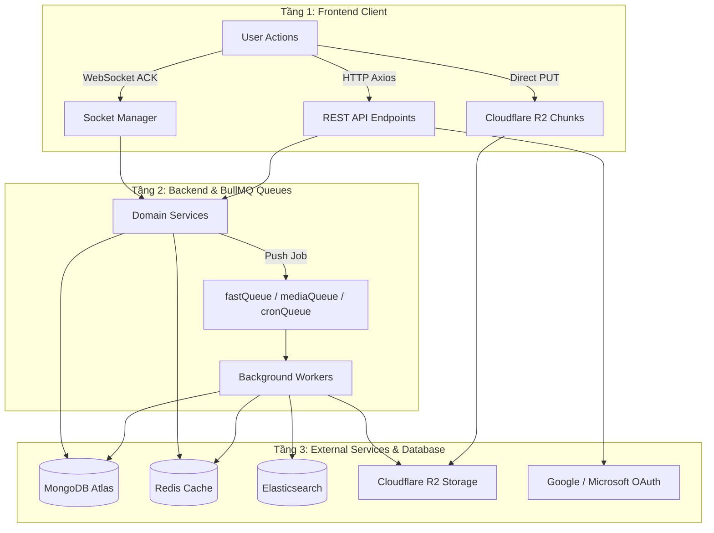
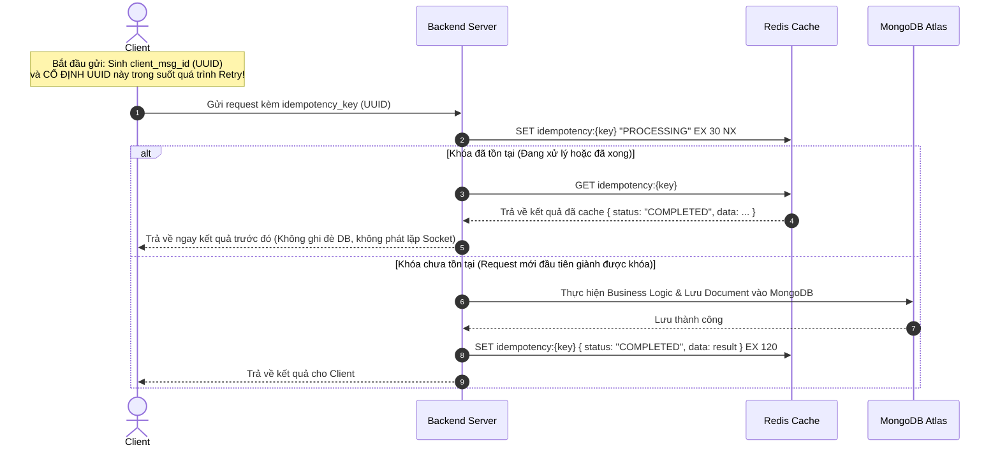
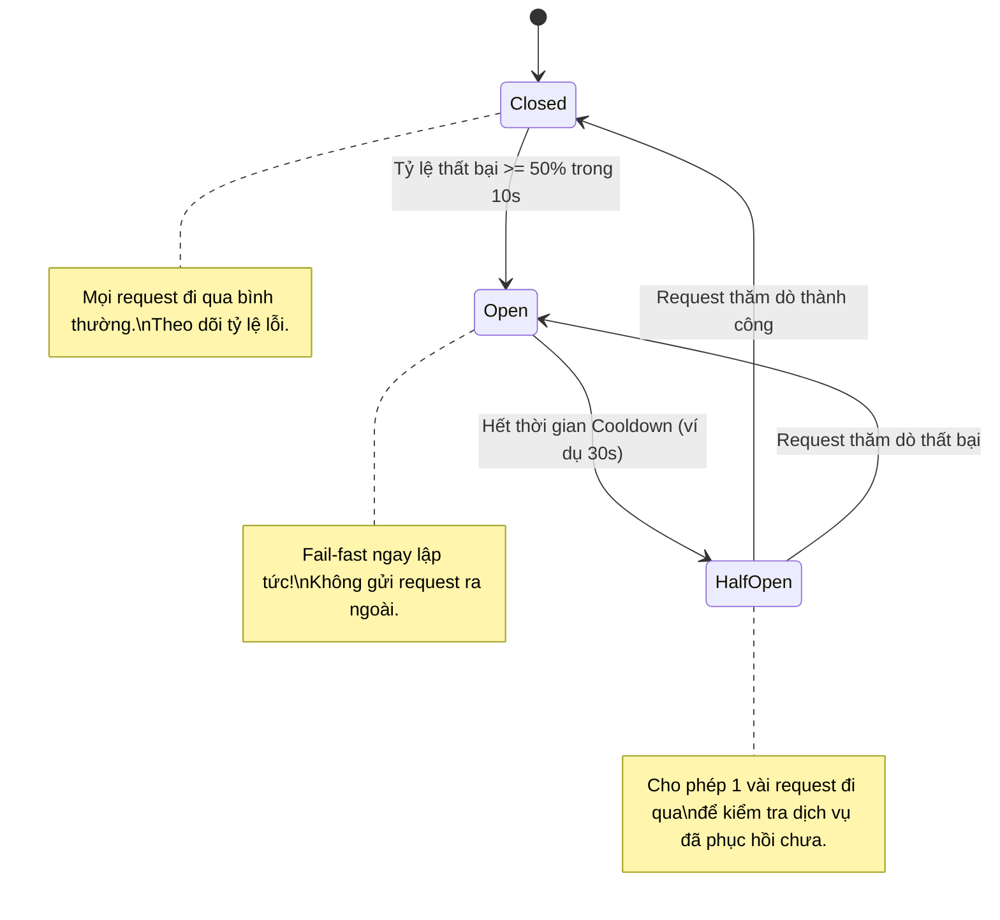

# Chiến Lược Hỗ Trợ Retry, Idempotency & Circuit Breaker Khi Gặp Lỗi Mạng

> **Tài liệu tham chiếu:** [Controlled AI Coding](file:///Users/ductri0981/Documents/Chatbot-HCMUS/.agent/skills/controlled-ai-coding/SKILL.md) | [Plan](file:///Users/ductri0981/Documents/Chatbot-HCMUS/plan.md)  
> **Trạng thái:** Bản thiết kế kỹ thuật chi tiết phân tích mã nguồn hệ thống Chatbot HCMUS.

---

## 1. Yêu Cầu & Nguyên Tắc Cốt Lõi

1. **Hỗ trợ Retry khi gặp sự cố mạng & hạ tầng:**
   - Xử lý khi server bị quá tải (Overloaded), Timeout (mạng trễ > ngưỡng cho phép), rớt gói tin hoặc lỗi 5xx.
   - Đặt giới hạn số lần retry (`retryCount`) và thời gian chờ tối đa (`timeout`).
2. **Exponential Backoff với Full Jitter (Chống Thundering Herd):**
   - Không retry dồn dập cùng lúc để tránh làm sập server đang bị nghẽn.
   - Công thức áp dụng:
     $$\text{Sleep} = \text{random}(0, \min(T_{\max}, T_{\text{base}} \times 2^{\text{attempt}}))$$
3. **Idempotency (Tính Bất Khả Biến / Chống Trùng Lặp):**
   - Đã retry thì **tuyệt đối không được gây side-effect lặp lại** (ví dụ: không tạo 2 nhóm chat, không gửi 2 tin nhắn trùng lặp).
   - Bảo vệ xuyên suốt **3 tầng**:
     - **Tầng 1 (Client):** Người dùng bấm gửi/tạo 2 lần liên tiếp do lag hoặc ứng dụng phản hồi chậm.
     - **Tầng 2 (Mạng):** Mạng rớt giữa chừng khi server đã nhận nhưng client chưa nhận được ACK/Response $\rightarrow$ Client retry.
     - **Tầng 3 (Worker):** Worker xử lý nền (BullMQ) bị restart hoặc crash giữa chừng và retry lại job.

> ❓ **Thảo Luận Kỹ Thuật: Frontend đã khóa nút gửi (`disabled={isUploading}`), tại sao Backend VẪN BẮT BUỘC cần Idempotency?**
> - **Mạng rớt chiều về (Asymmetric Network Failure):** Request gửi tin nhắn đã lên server thành công (đã ghi MongoDB), nhưng gói tin ACK phản hồi về client bị rớt/timeout > 5s $\rightarrow$ Frontend rơi vào `catch/finally`, nút gửi bị mở khóa trở lại $\rightarrow$ Người dùng tưởng lỗi nên bấm gửi lại lần 2 $\rightarrow$ Sinh tin nhắn trùng lặp!
> - **Tiến trình Auto-Retry chạy ngầm:** Khi kích hoạt cơ chế retry tự động theo yêu cầu hệ thống, client sẽ tự bắn lại request lần 2, 3 mà không cần user bấm. Nếu server không có khóa Idempotency, server sẽ ghi nhận mỗi lần retry là một tin nhắn mới.
> - **Race condition phím Enter / Double Click cực nhanh:** React cập nhật state `isUploading = true` là bất đồng bộ. Khoảng trễ vài mili-giây trước khi DOM thực sự disable có thể để lọt 2 sự kiện click/enter liên tiếp.
> - **Nguyên tắc "Zero Trust Client":** UI disable chỉ là UX tối ưu thao tác, không phải là cơ chế bảo vệ toàn vẹn dữ liệu. Backend là Single Source of Truth nên bắt buộc phải có Idempotency Guard độc lập.

> 🔑 **Nguyên Tắc Bất Biến Của UUID (Idempotency Key):**
> - **Sinh ngẫu nhiên 1 lần duy nhất:** Khi người dùng bắt đầu hành động (click Gửi / Tạo nhóm), Frontend gọi `crypto.randomUUID()` tạo ra chuỗi định danh duy nhất.
> - **BẮT BUỘC CỐ ĐỊNH trong toàn bộ các lần Retry:** Nếu gặp sự cố mạng, các lần retry (attempt 1, 2, 3) **phải giữ nguyên chuỗi UUID ban đầu**. Nhờ đó, Backend mới có thể nhận diện: *"Đây là request gửi lại của tác vụ trước đó, đã xử lý rồi, không được tạo mới nữa!"*.

4. **Circuit Breaker Pattern (Cắt Cầu Dao Fail-Fast):**
   - Khi tỷ lệ request thất bại vượt quá ngưỡng an toàn (ví dụ: $\ge 50\%$ lỗi trong cửa sổ trượt 10 giây), hệ thống chuyển sang trạng thái **OPEN** $\rightarrow$ từ chối ngay lập tức (fail-fast), không cho retry thêm để dịch vụ có thời gian hồi phục.
   - Sau thời gian cooldown, chuyển sang **HALF-OPEN** để thăm dò một vài request trước khi đóng mạch hoàn toàn (**CLOSED**).

---

## 2. Kiến Trúc 3 Tầng Giao Tiếp Có Nguy Cơ Trong Hệ Thống



---

## 3. Danh Sách Các Tính Năng Trong Hệ Thống Cần Áp Dụng

### 🔴 NHÓM 1: CỰC KỲ QUAN TRỌNG (Critical - Bắt buộc Retry + Idempotency cao nhất)

#### 1. Gửi tin nhắn văn bản & tệp đính kèm (`new_message` qua WebSocket ACK)
* **Vị trí mã nguồn:**
  - Frontend: [`socketService.emitWithAck("new_message", payload)`](file:///Users/ductri0981/Documents/Chatbot-HCMUS/frontend/src/features/chat/api/message.api.ts#L45)
  - Backend: [`MessageService.handleIncomingMessage`](file:///Users/ductri0981/Documents/Chatbot-HCMUS/backend/src/modules/message/message.service.ts#L29-L109)
* **Hiện trạng rủi ro:**
  - Chưa có cơ chế de-duplication. Mỗi lần nhận socket event, backend trực tiếp gọi `messageRepo.create(messageData)`.
  - Nếu timeout 5s ở socket client hoặc mạng chập chờn, user bấm gửi lại hoặc client retry $\rightarrow$ **Tin nhắn bị nhân bản 2-3 lần** trên giao diện mọi thành viên.
* **Giải pháp thiết kế:**
  - **Idempotency Key:** Client sinh `client_msg_id` (UUID v4) đính kèm payload.
  - **Redis Deduplication Window:** Backend kiểm tra bằng Redis key `idempotency:msg:{client_msg_id}` (TTL 60s). Nếu đã xử lý, trả về ngay kết quả cache hoặc bỏ qua ghi DB.
  - **Retry Policy:** Retry 3 lần, Timeout 5s/lần, Exponential Backoff với Jitter ($1\text{s} \pm 200\text{ms}$, $2\text{s} \pm 400\text{ms}$, $4\text{s} \pm 800\text{ms}$).

---

#### 2. Tạo cuộc trò chuyện nhóm (`new_conversation` qua WebSocket ACK)
* **Vị trí mã nguồn:**
  - Frontend: [`conversationApi.createGroup`](file:///Users/ductri0981/Documents/Chatbot-HCMUS/frontend/src/features/chat/api/conversation.api.ts#L22-L31)
  - Backend: [`ConversationService.createConversation`](file:///Users/ductri0981/Documents/Chatbot-HCMUS/backend/src/modules/conversation/conversation.service.ts#L25-L118)
* **Hiện trạng rủi ro:**
  - Hội thoại 1-1 (`utu`) và `self` đã có logic check tồn tại trong cache/DB.
  - Nhưng cuộc trò chuyện `group` **chưa có bất kỳ cơ chế idempotency nào**. Người dùng click đúp hoặc mạng lag retry sẽ sinh ra **2 nhóm chat hoàn toàn tách biệt** có cùng tên và danh sách thành viên.
* **Giải pháp thiết kế:**
  - **Idempotency Key:** Client truyền `idempotency_key` (UUID v4) khi submit form tạo nhóm.
  - **Distributed Lock:** Backend sử dụng Redis `SET idempotency:group:{key} {convId} EX 120 NX`. Nếu key đã tồn tại và đang xử lý, chặn request thứ 2; nếu đã có `convId`, trả về ngay nhóm đã tạo.
  - **Retry Policy:** Tối đa 2 lần, timeout 8s, backoff kèm jitter.

---

#### 3. Upload Video phân đoạn (Multipart Video Upload)
* **Vị trí mã nguồn:**
  - Frontend: [`uploadService.uploadVideoMultipart`](file:///Users/ductri0981/Documents/Chatbot-HCMUS/frontend/src/shared/services/upload.service.ts#L17-L75)
  - Backend: [`media.controller.ts`](file:///Users/ductri0981/Documents/Chatbot-HCMUS/backend/src/modules/media/media.controller.ts)
* **Hiện trạng rủi ro:**
  - Video lớn được chia thành các chunk 5MB. Frontend upload song song qua `fetch(presignedUrl, { method: "PUT", body: chunk })`.
  - Hiện tại dùng `Promise.all` mà **không hề có retry từng chunk**. Nếu file 100MB (20 chunks), chỉ cần 1 chunk gặp lỗi mạng hoặc Cloudflare R2 trả về `503 Service Unavailable`, **toàn bộ tiến trình sập và phải tải lại từ đầu 0%**.
* **Giải pháp thiết kế:**
  - **Retry cục bộ trên từng Chunk:** Mỗi chunk tự retry độc lập tối đa 3-5 lần bằng Exponential Backoff + Jitter.
  - **Idempotency tự nhiên:** S3 Multipart Upload là idempotent theo cặp `(UploadId, PartNumber)`. Ghi đè lại chunk cùng số thứ tự không làm biến đổi dữ liệu.
  - **Circuit Breaker cho Cloudflare R2:** Nếu 5 chunk liên tiếp lỗi 5xx trong 10s $\rightarrow$ Kích hoạt Circuit Breaker, dừng tải để tránh spam R2 và báo lỗi rõ ràng cho người dùng.

---

#### 4. Background Worker: Xử lý hậu kỳ Video (`process-video.job.ts`)
* **Vị trí mã nguồn:**
  - Backend: [`process-video.job.ts`](file:///Users/ductri0981/Documents/Chatbot-HCMUS/backend/src/background/jobs/process-video.job.ts#L63-L65)
* **Hiện trạng rủi ro:**
  - Đoạn code `catch (err) { console.error(...) }` **nuốt trọn lỗi mà không re-throw**. BullMQ xem job này đã hoàn thành (`completed`) dù bị lỗi mạng khi tải từ R2 hoặc lỗi FFmpeg, dẫn đến **BullMQ không bao giờ kích hoạt retry**. Video bị kẹt vĩnh viễn ở trạng thái đang xử lý.
* **Giải pháp thiết kế:**
  - **Kích hoạt Retry BullMQ:** Bắt buộc re-throw lỗi sau khi dọn dẹp file tạm để BullMQ retry 3 lần theo cấu hình `attempts: 3` và backoff cấp số nhân.
  - **Idempotency trong Worker:** Xóa file tạm trong `/tmp` theo `job.id` trước khi chạy lại; hàm `handleVideoReady` cập nhật MongoDB và Redis là thao tác idempotent (ghi đè URL).

---

### 🟡 NHÓM 2: QUAN TRỌNG (High Priority - Tính Nhất Quán Dữ Liệu)

#### 5. Đồng bộ tìm kiếm Elasticsearch (`sync-es.job.ts`)
* **Vị trí mã nguồn:** [`sync-es.job.ts`](file:///Users/ductri0981/Documents/Chatbot-HCMUS/backend/src/background/jobs/sync-es.job.ts)
* **Hiện trạng rủi ro:**
  - Khi node Elasticsearch bị quá tải, đầy heap size hoặc restart, việc index document sẽ thất bại khiến kết quả tìm kiếm không đồng bộ với MongoDB.
* **Giải pháp thiết kế:**
  - **BullMQ Retry:** Retry 3-5 lần với backoff 2s, 4s, 8s.
  - **Idempotency tự nhiên:** Elasticsearch sử dụng `id: documentId` nên lệnh index là upsert tự nhiên.
  - **Circuit Breaker cho ES Client:** Tránh để hàng trăm job sync dồn ứ làm tràn RAM Redis khi ES bị gián đoạn kéo dài.

---

#### 6. Thả / Gỡ cảm xúc tin nhắn (`message_reaction_updated` qua WebSocket ACK)
* **Vị trí mã nguồn:** [`MessageService.toggleReaction`](file:///Users/ductri0981/Documents/Chatbot-HCMUS/backend/src/modules/message/message.service.ts#L401-L426)
* **Hiện trạng rủi ro:**
  - Hiện tại sử dụng cơ chế `toggle` (nếu có rồi thì xóa, chưa có thì thêm).
  - Nếu client bị lag timeout rồi retry lệnh `toggle`, **người dùng vừa thả tim xong sẽ bị hệ thống tự động gỡ tim ra**!
* **Giải pháp thiết kế:**
  - **Explicit Action Idempotency:** Payload socket retry phải truyền rõ ý định: `{ action: 'ADD' | 'REMOVE', emoji: '❤️' }` thay vì `toggle` mơ hồ.

---

#### 7. Tự động cấp lại Access Token (`/auth/refresh-token` qua Axios Interceptor)
* **Vị trí mã nguồn:** [`frontend/src/lib/api.ts`](file:///Users/ductri0981/Documents/Chatbot-HCMUS/frontend/src/lib/api.ts#L77-L84)
* **Hiện trạng rủi ro:**
  - Nếu gặp sự cố mạng chập chờn (timeout, mất sóng 1 giây) khi gọi `/api/auth/refresh-token`, interceptor lập tức kích hoạt `handleForceLogout()` và đá người dùng ra màn hình đăng nhập.
* **Giải pháp thiết kế:**
  - **Phân loại lỗi:** Chỉ force logout khi nhận lỗi `401 Unauthorized` từ server (token bị thu hồi/hết hạn).
  - **Retry khi lỗi mạng:** Nếu gặp lỗi `ECONNABORTED`, `ETIMEDOUT` hoặc mất kết nối, thực hiện retry 2 lần với backoff 1s - 2s trước khi kết luận đăng xuất.

---

#### 8. Đồng bộ trạng thái đã nhận / đã đọc (`watermark_updated`)
* **Vị trí mã nguồn:** [`MessageService.updateWatermark`](file:///Users/ductri0981/Documents/Chatbot-HCMUS/backend/src/modules/message/message.service.ts#L432-L461)
* **Giải pháp thiết kế:**
  - Tự động idempotent theo số mốc thời gian / ID tin nhắn (chỉ cập nhật tăng tiến, không cập nhật lùi).
  - Gộp (debounce) các sự kiện watermark khi mạng chập chờn và đồng bộ lại 1 lần duy nhất khi socket reconnect thành công.

---

### 🟢 NHÓM 3: TÍNH NĂNG ĐỌC & QUẢN TRỊ (Medium Priority)

| STT | Tính năng | Giao thức | Nguy cơ khi lỗi mạng | Chiến lược Xử Lý |
| :---: | :--- | :---: | :--- | :--- |
| **9** | **Đọc tin nhắn / Hội thoại** (`getMessages`, `getConversations`) | HTTP GET | Timeout khi sóng yếu | Tận dụng TanStack Query retry 2 lần (an toàn tuyệt đối vì phương thức `GET` idempotent). |
| **10** | **Quản trị thành viên nhóm** (`members_added`, `members_kicked`) | WebSocket ACK | Timeout khi mạng lag | Thao tác MongoDB dùng `$addToSet` và `$pull` nên idempotent tự nhiên; client retry an toàn. |
| **11** | **Xác thực Google / Microsoft** (`verifyIdToken`) | HTTP POST | Mạng tới Google Auth bị gián đoạn | Circuit Breaker phía backend tránh nghẽn luồng xác thực khi Google Identity gặp sự cố. |

---

## 4. Ma Trận Đánh Giá Tổng Hợp

| STT | Tính năng | Tầng phát sinh | Cần Retry? | Chiến lược Backoff | Cần Idempotency? | Cần Circuit Breaker? |
| :---: | :--- | :---: | :---: | :---: | :---: | :---: |
| **1** | **Gửi tin nhắn** (`new_message`) | Client $\rightarrow$ Server | **BẮT BUỘC** | Exp. Backoff + Jitter (3 lần) | **BẮT BUỘC (`client_msg_id`)** | Không |
| **2** | **Tạo nhóm chat** (`new_conversation`) | Client $\rightarrow$ Server | **BẮT BUỘC** | Exp. Backoff + Jitter (2 lần) | **BẮT BUỘC (`idempotency_key`)** | Không |
| **3** | **Upload từng Chunk Video** | Client $\rightarrow$ R2 (S3) | **BẮT BUỘC** | Exp. Backoff + Jitter (3-5 lần) | Tự nhiên theo `PartNumber` | **BẮT BUỘC (R2)** |
| **4** | **Hậu kỳ Video** (`process-video.job`) | BullMQ Worker | **BẮT BUỘC** | Exp. Backoff (BullMQ 3 lần) | Tự nhiên theo `fileKey` | **CÓ (R2)** |
| **5** | **Đồng bộ Elasticsearch** (`sync-es.job`) | BullMQ Worker | **BẮT BUỘC** | Exp. Backoff (BullMQ 3 lần) | Tự nhiên theo `documentId` | **BẮT BUỘC (ES)** |
| **6** | **Thả Reaction** (`toggleReaction`) | Client $\rightarrow$ Server | **NÊN CÓ** | Exp. Backoff (2 lần) | **BẮT BUỘC (Explicit Action)** | Không |
| **7** | **Làm mới Token** (`refresh-token`) | Client $\rightarrow$ Server | **NÊN CÓ** | Backoff 1s - 2s (2 lần) | Tự nhiên | Không |
| **8** | **Đánh dấu Watermark** | Client $\rightarrow$ Server | **NÊN CÓ** | Retry khi reconnect | Tự nhiên theo mốc đọc | Không |

---

## 5. Thiết Kế Chi Tiết Các Mẫu Cấu Trúc (Design Patterns)

### 5.1. Công thức Exponential Backoff với Full Jitter

```typescript
export async function retryWithBackoff<T>(
    fn: () => Promise<T>,
    options: {
        maxRetries?: number;
        baseDelayMs?: number;
        maxDelayMs?: number;
        shouldRetry?: (error: any) => boolean;
    } = {}
): Promise<T> {
    const { maxRetries = 3, baseDelayMs = 1000, maxDelayMs = 10000, shouldRetry } = options;

    let attempt = 0;
    while (true) {
        try {
            return await fn();
        } catch (error: any) {
            attempt++;
            if (attempt > maxRetries || (shouldRetry && !shouldRetry(error))) {
                throw error;
            }
            // Full Jitter: Sleep ngẫu nhiên từ 0 đến min(maxDelay, baseDelay * 2^attempt)
            const exponentialLimit = Math.min(maxDelayMs, baseDelayMs * Math.pow(2, attempt));
            const jitterDelay = Math.floor(Math.random() * exponentialLimit);

            await new Promise((resolve) => setTimeout(resolve, jitterDelay));
        }
    }
}
```

### 5.2. Luồng Xử Lý Idempotency với Redis Distributed Lock



#### 5.2.1. Cải tiến hàm `set` trong [`redis.client.ts`](file:///Users/ductri0981/Documents/Chatbot-HCMUS/backend/src/infrastructure/redis/redis.client.ts) (Giữ trọn tính Đóng Gói - Encapsulation)
Thay vì để rò rỉ client thô qua `getClient()`, sửa thẳng hàm `set` hiện có để hỗ trợ cờ `NX` (Atomic Lock), tương thích ngược 100%:

```typescript
// backend/src/infrastructure/redis/redis.client.ts

async set(
    key: string,
    value: string,
    ttlSeconds: number,
    nx: boolean = false
): Promise<boolean> {
    try {
        console.log(`[Redis] SET: ${key}${nx ? " (NX)" : ""}`);
        
        if (nx) {
            const result = await this.client.set(key, value, "EX", ttlSeconds, "NX");
            return result === "OK";
        }

        await this.client.set(key, value, "EX", ttlSeconds);
        return true;
    } catch (error) {
        console.error(`[Redis] SET error on ${key}:`, error);
        return false;
    }
}
```

#### 5.2.2. Triển khai Class `IdempotencyService` tại [`idempotency.service.ts`](file:///Users/ductri0981/Documents/Chatbot-HCMUS/backend/src/infrastructure/redis/idempotency.service.ts)

```typescript
// backend/src/infrastructure/redis/idempotency.service.ts
import { redisClient, RedisClient } from "./redis.client.js";

export interface IdempotencyResult<T> {
    isDuplicate: boolean;
    data: T;
}

interface IdempotencyRecord<T> {
    status: "PROCESSING" | "COMPLETED";
    data?: T;
}

export class IdempotencyService {
    private readonly prefix = "idempotency:";

    constructor(private readonly redis: RedisClient) {}

    async execute<T>(
        key: string,
        ttlSeconds: number,
        action: () => Promise<T>
    ): Promise<IdempotencyResult<T>> {
        const fullKey = `${this.prefix}${key}`;

        // 1. Thử giành Khóa phân tán (Atomic Lock) thông qua hàm set(..., nx = true)
        const lockAcquired = await this.redis.set(
            fullKey,
            JSON.stringify({ status: "PROCESSING" }),
            Math.min(ttlSeconds, 30),
            true // <-- nx = true
        );

        // 2. Nếu không giành được khóa -> Đây là request gửi lặp lại
        if (!lockAcquired) {
            console.log(`[IdempotencyService] ⚠️ Phát hiện request trùng lặp với key: ${key}`);
            
            const cached = await this.redis.getJSON<IdempotencyRecord<T>>(fullKey);
            if (cached && cached.status === "COMPLETED" && cached.data) {
                return { isDuplicate: true, data: cached.data };
            }

            // Nếu request trước ĐANG XỬ LÝ (PROCESSING) -> Fail-Fast ngay lập tức
            throw createHttpError.Conflict("Yêu cầu trước đó đang được xử lý, vui lòng không thao tác liên tục.");
        }

        // 3. Nếu là request đầu tiên -> Thực thi nghiệp vụ và lưu kết quả
        try {
            const result = await action();
            await this.redis.setJSON(
                fullKey,
                { status: "COMPLETED", data: result } as IdempotencyRecord<T>,
                ttlSeconds
            );
            return { isDuplicate: false, data: result };
        } catch (error) {
            // Giải phóng khóa ngay nếu nghiệp vụ bị lỗi để client có thể retry an toàn
            await this.redis.del(fullKey);
            throw error;
        }
    }
}

export const idempotencyService = new IdempotencyService(redisClient);
```

### 5.3. Mô Hình Circuit Breaker (Cắt Cầu Dao Fail-Fast)



---

## 6. Kế Hoạch Triển Khai Chi Tiết (Tuân Thủ Clean Architecture & Anti-Spam Files)

> ⚠️ **Quy Tắc Bất Di Bất Dịch Khi Code:**
> 1. **Tuân thủ Clean Architecture & Modular Monolith:** Tuyệt đối không tạo thư mục lạ, không lồng subfolder tùy tiện trong module.
> 2. **Tách biệt đúng tầng trách nhiệm:** 
>    - `retry` là pure algorithmic logic (vô trạng thái) $\rightarrow$ đặt tại `src/shared/utils/retry.util.ts`.
>    - `circuit-breaker` là cơ chế bảo vệ kết nối hạ tầng (Stateful Pattern) $\rightarrow$ đặt tại `src/infrastructure/resilience/circuit-breaker.ts`.
>    - `idempotency` là dịch vụ hạ tầng gắn liền với Redis $\rightarrow$ đặt tại `src/infrastructure/redis/idempotency.service.ts`.
> 3. **Tận dụng tối đa file hiện có:** Mở rộng logic trên các file Service, DTO, Repository, Socket, API có sẵn thay vì đẻ thêm abstractions thừa thãi.
> 4. **Giao tiếp Module qua Facade:** Mọi kiểm tra quyền hoặc nghiệp vụ chéo vẫn phải đi qua `*.facade.ts`.

```
BẢN ĐỒ CÁC FILE ĐƯỢC PHÉP CHỈNH SỬA & TẠO MỚI:

backend/src/
├── infrastructure/
│   ├── redis/
│   │   ├── redis.client.ts           <-- [SỬA] Nâng cấp hàm set() hỗ trợ tham số nx = true (Atomic Lock)
│   │   └── idempotency.service.ts    <-- [TẠO MỚI 1] Lớp IdempotencyService quản lý Distributed Lock & Cache Store
│   ├── resilience/
│   │   └── circuit-breaker.ts        <-- [TẠO MỚI 2] Lớp CircuitBreaker bảo vệ kết nối hạ tầng (R2, ES, OAuth)
│   └── storage/
│       └── r2-storage.service.ts     <-- [SỬA] Bọc downloadFile, uploadFile, uploadImage qua Circuit Breaker
├── shared/utils/
│   └── retry.util.ts                 <-- [TẠO MỚI 3] Hàm retryWithBackoff + Jitter thuần túy
├── modules/
│   ├── message/
│   │   ├── message.dto.ts            <-- [SỬA] Bổ sung optional client_msg_id
│   │   └── message.service.ts        <-- [SỬA] Chặn trùng lặp tin nhắn bằng idempotencyService.execute
│   ├── conversation/
│   │   ├── conversation.dto.ts       <-- [SỬA] Bổ sung optional idempotency_key
│   │   └── conversation.service.ts   <-- [SỬA] Chặn tạo 2 nhóm trùng lặp khi retry bằng idempotencyService.execute
│   └── auth/strategies/
│       ├── google.strategy.ts        <-- [SỬA] Bọc xác thực Google ID Token qua Circuit Breaker
│       └── microsoft.strategy.ts     <-- [SỬA] Bọc xác thực Azure AD Token qua Circuit Breaker
└── background/jobs/
    ├── process-video.job.ts          <-- [SỬA] Re-throw lỗi để BullMQ kích hoạt retry cơ chế có sẵn
    └── sync-es.job.ts                <-- [SỬA] Bọc đồng bộ Elasticsearch qua Circuit Breaker

frontend/src/
├── shared/
│   ├── utils/
│   │   └── retry.util.ts             <-- [TẠO MỚI 4] Hàm retryWithBackoff + Jitter phía client
│   └── services/
│       ├── socket.service.ts         <-- [SỬA] Tích hợp retry + jitter cho emitWithAck
│       └── upload.service.ts         <-- [SỬA] Retry từng chunk video 5MB độc lập + UploadCircuitBreaker
├── features/chat/api/
│   ├── message.api.ts                <-- [SỬA] Tự động sinh client_msg_id (crypto.randomUUID) và cố định khi retry
│   └── conversation.api.ts           <-- [SỬA] Tự động sinh idempotency_key khi tạo nhóm và cố định khi retry
└── lib/api.ts                        <-- [SỬA] Tinh chỉnh refresh-token interceptor retry khi lỗi mạng
```

---

### Giai Đoạn 1: Xây Dựng Core Utilities & Hạ Tầng (Backend & Frontend)

#### 1.1. Hạ Tầng Redis & Idempotency Backend (`backend/src/infrastructure/redis/`)
* **Chỉnh sửa file `redis.client.ts`:**
  - Nâng cấp hàm `set(key, value, ttlSeconds, nx = false): Promise<boolean>` để hỗ trợ cờ `NX` nguyên tử.
* **Tạo mới file `idempotency.service.ts`:**
  - Khởi tạo class `IdempotencyService` nhận `RedisClient`.
  - Cung cấp hàm `execute<T>(key, ttlSeconds, action): Promise<IdempotencyResult<T>>`.
  - Sử dụng hàm `this.redis.set(..., true)` để chiếm khóa mà không gọi qua `getClient()`.

#### 1.2. Hạ Tầng Bảo Vệ Resilience (`backend/src/infrastructure/resilience/`)
* **Tạo mới file `circuit-breaker.ts`:**
  - Class `CircuitBreaker`: Quản lý 3 trạng thái (`CLOSED`, `OPEN`, `HALF_OPEN`), cửa sổ trượt (rolling window) đo tỷ lệ lỗi trong 10 giây, thời gian hồi phục (cooldown probe), fail-fast khi tỷ lệ lỗi vượt ngưỡng $\ge 50\%$.

#### 1.3. Shared Utilities Backend (`backend/src/shared/utils/`)
* **Tạo mới file `retry.util.ts`:**
  - `retryWithBackoff<T>(fn, options)`: Thực thi hàm bất đồng bộ với cơ chế Exponential Backoff kèm Full Jitter thuần túy.

#### 1.4. Frontend Shared Utility (`frontend/src/shared/utils/`)
* **Tạo mới file `retry.util.ts`:**
  - Cung cấp hàm `retryWithBackoff<T>` tương tự backend để dùng chung cho `socket.service.ts`, `upload.service.ts` và `api.ts`.

---

### Giai Đoạn 2: Tích Hợp Idempotency & Retry Vào Messaging & Conversation `[ĐÃ HOÀN THÀNH]`

#### 2.1. Backend Messaging (`backend/src/modules/message/`) `[ĐÃ HOÀN THÀNH]`
* **Chỉnh sửa `message.dto.ts`:**
  - Thêm trường `client_msg_id?: string;` vào `SendMessageDto`.
* **Chỉnh sửa `message.service.ts`:**
  - Tại hàm `handleIncomingMessage`:
    - Nếu có `payload.client_msg_id`: Gọi `idempotencyService.execute("msg:" + client_msg_id, 60, async () => { ...lưu DB, cache, socket... })`.
    - Nếu request đã được xử lý: Trả về ngay message đã lưu mà không ghi thêm vào MongoDB và không broadcast socket lặp lại.

#### 2.2. Backend Conversation (`backend/src/modules/conversation/`) `[ĐÃ HOÀN THÀNH]`
* **Chỉnh sửa `conversation.dto.ts`:**
  - Thêm trường `idempotency_key?: string;` vào `CreateConversationDto`.
* **Chỉnh sửa `conversation.service.ts`:**
  - Tại hàm `createConversation`:
    - Nếu `data.type === 'group'` và có `data.idempotency_key`:
      - Bọc logic tạo group qua `idempotencyService.execute("group:" + idempotency_key, 120, async () => { ...tạo MongoDB, Redis, socket... })`.
      - Đảm bảo nếu client gửi retry cùng `idempotency_key`, server trả về đúng instance nhóm đã tạo trước đó, loại bỏ 100% rủi ro tạo 2 nhóm trùng lặp.

#### 2.3. Frontend Client Integration `[ĐÃ HOÀN THÀNH]`
* **Chỉnh sửa `features/chat/api/message.api.ts`:**
  - Trong `sendMessage`: Tự động sinh `client_msg_id: crypto.randomUUID()` **1 lần duy nhất** và giữ nguyên giá trị này khi retry qua `socketService.emitWithAck`.
* **Chỉnh sửa `features/chat/api/conversation.api.ts`:**
  - Trong `createGroup`: Tự động gán `idempotency_key: crypto.randomUUID()` **1 lần duy nhất** vào payload và giữ nguyên khi retry.
* **Chỉnh sửa `shared/services/socket.service.ts`:**
  - Mở rộng hàm `emitWithAck<T>(event, data, options?: { maxRetries?: number; timeoutMs?: number })`:
    - Bọc việc gửi socket ACK bằng `retryWithBackoff`.
    - Nếu bị timeout hoặc mạng ngắt kết nối tạm thời, tự động thử lại sau $T = \text{random}(0, 1000 \times 2^{\text{attempt}})\text{ms}$.

---

### Giai Đoạn 3: Nâng Cấp Bền Bỉ Cho Media & Background Worker `[ĐÃ HOÀN THÀNH]`

#### 3.1. Frontend Chunk-Level Retry & Circuit Breaker (`upload.service.ts`) `[ĐÃ HOÀN THÀNH]`
* **Chỉnh sửa `frontend/src/shared/services/upload.service.ts`:**
  - Tại hàm `uploadVideoMultipart`:
    - Thay vì gọi `fetch(presignedUrl, { method: "PUT" })` trần, bọc từng chunk upload bằng `retryWithBackoff`:
      ```typescript
      await retryWithBackoff(() => fetch(presignedUrl, { method: "PUT", body: chunk }), {
          maxRetries: 3,
          baseDelayMs: 1000,
          shouldRetry: (err) => !err.response || err.response.status >= 500
      });
      ```
    - Nếu 1 chunk bị đứt kết nối hoặc R2 lag tạm thời, chunk đó sẽ tự retry độc lập với backoff có jitter, không làm đổ vỡ các chunk khác.
    - Tích hợp `CircuitBreaker`: Nếu Cloudflare R2 liên tục trả về 5xx (quá 50% trong 10s) $\rightarrow$ Ngắt mạch upload ngay lập tức, hiển thị thông báo "Máy chủ lưu trữ đang bận" để tránh tốn băng thông người dùng.

#### 3.2. Sửa Lỗi Nuốt Exception Tại Background Job (`process-video.job.ts`) `[ĐÃ HOÀN THÀNH]`
* **Chỉnh sửa `backend/src/background/jobs/process-video.job.ts`:**
  - Xóa bỏ việc nuốt lỗi ở khối `catch (err) { console.error(...) }`.
  - Quy trình chuẩn:
    ```typescript
    try {
        // Tải video từ R2, chạy FFmpeg, upload lại R2
    } catch (err) {
        console.error(`[QueueWorker] Lỗi xử lý hậu kỳ video ${fileKey}:`, err);
        throw err; // BẮT BUỘC throw để BullMQ ghi nhận Job Failed và kích hoạt Retry!
    } finally {
        // Luôn luôn dọn sạch file tạm trong /tmp
    }
    ```
  - BullMQ tại [`queue.service.ts`](file:///Users/ductri0981/Documents/Chatbot-HCMUS/backend/src/background/queue.service.ts#L63-L67) đã có sẵn cấu hình `attempts: 3` và `exponential backoff 2000ms`, job sẽ tự động được thử lại an toàn.

---

### Giai Đoạn 4: Tinh Chỉnh Axios Interceptor Cho Refresh Token `[ĐÃ HOÀN THÀNH]`

#### 4.1. Frontend HTTP Client (`frontend/src/lib/api.ts` hoặc `api.client.ts`) `[ĐÃ HOÀN THÀNH]`
* **Chỉnh sửa `api.ts`:**
  - Khi request refresh token `/auth/refresh-token` gặp lỗi mạng (`!error.response` hoặc `error.code === 'ECONNABORTED'`), không lập tức gọi `handleForceLogout()`.
  - Áp dụng `retryWithBackoff` thử lại tối đa 2 lần với khoảng cách 1s - 2s.
  - Chỉ khi server phản hồi mã HTTP `401` hoặc `403` chính thức (refresh token không hợp lệ hoặc đã bị thu hồi) thì mới ép buộc logout.

### Giai Đoạn 5: Mở Rộng Circuit Breaker Bảo Vệ Hạ Tầng Backend (Storage, Elasticsearch, OAuth) `[ĐÃ HOÀN THÀNH]`

#### 5.1. Bảo Vệ Dịch Vụ Lưu Trữ Cloudflare R2 (`backend/src/infrastructure/storage/r2-storage.service.ts`) `[ĐÃ HOÀN THÀNH]`
* **Mục tiêu:** Tránh làm nghẽn Event Loop hoặc cạn kiệt socket pool khi Cloudflare R2 gặp sự cố downtime hoặc nghẽn mạng quốc tế.
* **Chỉnh sửa `r2-storage.service.ts`:**
  - Khởi tạo instance `r2CircuitBreaker` từ class `CircuitBreaker` (`failureThresholdRatio: 0.5`, `minimumRequests: 5`, `samplingPeriodMs: 10000`, `cooldownPeriodMs: 30000`).
  - Bọc các hàm I/O mạng nặng:
    - `uploadImage(...)`: Bọc `PutObjectCommand` qua `r2CircuitBreaker.execute(...)`.
    - `uploadFile(...)`: Bọc stream upload qua `r2CircuitBreaker.execute(...)`.
    - `downloadFile(...)`: Bọc `GetObjectCommand` stream qua `r2CircuitBreaker.execute(...)`.
  - **Hành vi ngắt mạch (OPEN):** Khi R2 lỗi $\ge 50\%$ trong 10s, cầu dao ngắt ngay (fail-fast), ném lỗi `CircuitBreakerOpenException` tức thì mà không mở thêm kết nối mạng, bảo vệ Worker và Web Process khỏi sụp đổ dây chuyền.

#### 5.2. Bảo Vệ Đồng Bộ Elasticsearch (`backend/src/background/jobs/sync-es.job.ts`) `[ĐÃ HOÀN THÀNH]`
* **Mục tiêu:** Ngăn chặn tình trạng hàng nghìn job đồng bộ dữ liệu (`sync_es`) làm treo `fastWorker` khi cụm Elasticsearch bị quá tải CPU/RAM hoặc mất kết nối.
* **Chỉnh sửa `sync-es.job.ts`:**
  - Khởi tạo instance `esCircuitBreaker` (`failureThresholdRatio: 0.5`, `samplingPeriodMs: 10000`, `cooldownPeriodMs: 30000`).
  - Bọc các thao tác `esClient.index(...)` và `esClient.delete(...)` qua `esCircuitBreaker.execute(...)`.
  - **Hành vi khi Elasticsearch gặp sự cố:**
    - Cầu dao chuyển sang `OPEN`, ném lỗi nhanh để BullMQ chuyển job vào trạng thái retry với backoff dãn nở thay vì liên tục bắn request làm sập hoàn toàn Elasticsearch.
    - `fastWorker` không bị giữ socket chờ timeout 30s của Elasticsearch, giữ cho các tác vụ quan trọng khác (`create_message`, `sync_watermark`) vẫn hoạt động trơn tru.

#### 5.3. Bảo Vệ Xác Thực Bên Thứ Ba - Google OAuth & Azure/Microsoft (`backend/src/modules/auth/strategies/`) `[ĐÃ HOÀN THÀNH]`
* **Mục tiêu:** Loại bỏ hoàn toàn tình trạng treo request 30s rồi trả lỗi 504 Gateway Timeout khi mạng quốc tế hoặc dịch vụ Identity của Google/Microsoft bị gián đoạn.
* **Chỉnh sửa `google.strategy.ts`:**
  - Khởi tạo `googleAuthCircuitBreaker`.
  - Bọc hàm xác thực Google ID Token qua `googleAuthCircuitBreaker.execute(...)`.
  - Khi ngắt mạch, ném ngay lỗi `503 Service Unavailable`: *"Dịch vụ xác thực Google tạm thời gián đoạn, vui lòng đăng nhập bằng Email/Mật khẩu."*
* **Chỉnh sửa `microsoft.strategy.ts`:**
  - Khởi tạo `azureAuthCircuitBreaker`.
  - Bọc thao tác exchange token / lấy thông tin user từ Microsoft Graph API qua `azureAuthCircuitBreaker.execute(...)`.
  - Khi ngắt mạch, phản hồi nhanh lỗi `503 Service Unavailable`: *"Dịch vụ xác thực Microsoft tạm thời gián đoạn, vui lòng đăng nhập bằng Email/Mật khẩu."*

---

## 7. Bảng Kiểm Tra Định Kỳ (Verification & Checklist)

| Mục kiểm tra | Tiêu chí đạt | Cách kiểm chứng |
| :--- | :--- | :--- |
| **Chống gửi 2 tin nhắn** | Người dùng spam click "Gửi" liên tục chỉ sinh đúng 1 tin nhắn duy nhất trong DB và 1 socket event. | Gửi 2 request cùng `client_msg_id` trong cùng 100ms. |
| **Chống tạo 2 nhóm chat** | Nhấn "Tạo nhóm" nhiều lần liên tục chỉ tạo duy nhất 1 conversation trong MongoDB. | Bắn 2 socket `new_conversation` cùng `idempotency_key`. |
| **Video Chunk Resilience** | Chặn mạng giả lập (Network Throttling / Offline 2s) trong khi upload video, tiến trình tự thử lại chunk bị lỗi và upload thành công 100%. | Giả lập lỗi ở 1 presigned PUT request trong devtools. |
| **BullMQ Video Retry** | Khi R2 gặp lỗi mạng tạm thời, worker ném exception và BullMQ hiển thị `attemptsMade` tăng lên 1, 2, 3 với khoảng trễ cấp số nhân. | Mock lỗi ở `mediaFacade.downloadFile` trong unit test. |
| **Storage Circuit Breaker** | Khi R2 sập, các thao tác download/upload tại backend ngắt mạch tức thì, ném CircuitBreakerOpenException mà không treo process. | Mock lỗi liên tiếp tại R2 storage service trong unit test. |
| **Elasticsearch Resilience** | Khi Elasticsearch quá tải, job sync fail-fast, không làm nghẽn fastWorker. | Giả lập lỗi kết nối ES trong sync-es.job. |
| **OAuth Identity Protection** | Khi Google/Azure Auth bị timeout, hệ thống fail-fast trả 503 thay vì chờ 30s timeout. | Mock lỗi mạng tới Google Auth endpoint trong test. |
| **Không vi phạm kiến trúc** | Không có bất kỳ file tạm, folder lạ hay vi phạm Facade nào phát sinh. | Kiểm tra `git status` và chạy `npm run lint` / `npm test`. |

